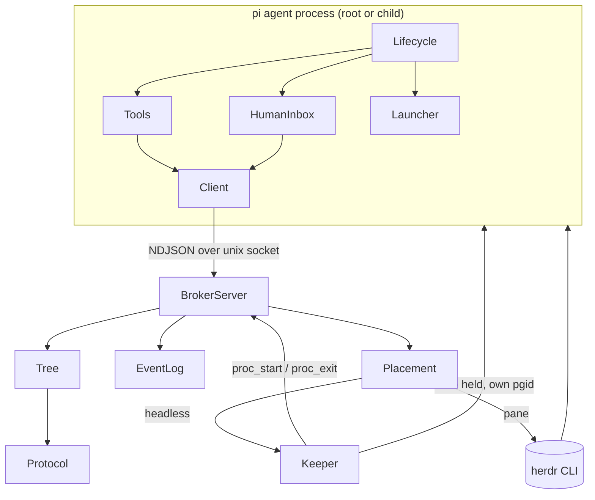
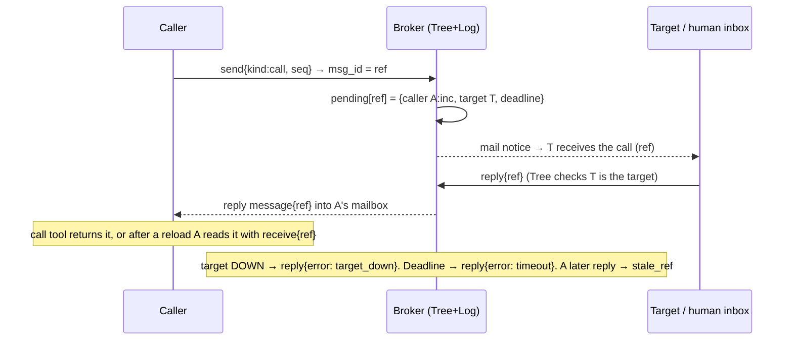

# pi-actors — Design (v2)

**Spec:** `specs/pi-actors.md` · **Frame:** no standing frame in this new repo. It uses the default 3-layer split (domain / presentation / shell) plus the conventions of the sibling package `~/work/pi-verified-goal` (TypeScript under `src/`, `node --test`, pi and `typebox` as `*` peers, extension tests through a fake pi host). · **Scope note:** this adds local helper processes and one channel. It stays a feature design because it is one package on one machine (NFR-2). · **Revision:** v2 addresses design-review findings R1–R21 of 2026-10-05; see "Revision log".

## Context and goals

pi agents need to spawn fresh or forked children on any model and exchange messages reliably (UC-1..9). The incumbent's bug history comes from many ad-hoc file protocols and from detecting liveness by PID: stale state, lost and duplicated messages, orphans, and reload breakage. This design copies the Erlang/OTP split:

- isolated processes with one mailbox each;
- one broker per agent tree, owning the registry, mailboxes, links and limits behind one Unix socket;
- a **keeper** process per headless child, owning that child's OS process and stdio, so the broker can crash and restart without its children noticing;
- one pure state machine whose transitions are written to an append-only log, so the broker can be rebuilt by replaying it;
- identity fenced by incarnation and process ID.

Where an agent runs (headless or a terminal pane) and how its context starts (fresh or fork) are adapters orthogonal to messaging (INV-9).

## Non-goals

- **Workflow engine, fan-out or chain helpers.** Agents compose these from the primitives; built-in workflows are where the incumbent grew to 106k lines.
- **Live mid-turn injection of message content.** Content reaches the model only as a `receive` result (D3).
- **Retries or model fallback inside agents.** Children "let it crash", and the parent decides from the exit reason.
- **Cross-machine transport** (NFR-2). Revisit with NATS JetStream if ever needed.
- **Non-pi agents.** The wire protocol is versioned (D12), so a later non-pi client stays a local addition.
- **Deduplicating messages the model deliberately sends twice.** Only retries by the transport are deduplicated (spec INV-3).
- **Changes to pi-verified-goal.** That package consumes the events defined under "Integration"; changing it is a separate task.

## Components

| Component    | Responsibility                                                                                                                                                                               | Layer        | Depends on                          | Interface                                                         | Files                                                |
| ------------ | -------------------------------------------------------------------------------------------------------------------------------------------------------------------------------------------- | ------------ | ----------------------------------- | ----------------------------------------------------------------- | ---------------------------------------------------- |
| Protocol     | Frame types, `PROTO` version, size limits, hand-written validators (no typebox, so the broker has no dependencies), NDJSON codec                                                             | Domain       | —                                   | `Frame` union, `validate(x): Frame`, `encode`, `decode`, `LIMITS` | `src/protocol.ts`                                    |
| Tree         | Pure state machine for agents, incarnations, mailboxes, sender sequences, pending calls, limits, usage and exit reasons                                                                      | Domain       | Protocol                            | `apply(state, event, now): {state, effects[]}`; `initial(treeId)` | `src/tree.ts`                                        |
| EventLog     | Append-only log with a versioned header; fsync before ack; replay that drops a cut-off final line; size-triggered compaction                                                                 | Shell        | Protocol                            | `open(dir)`, `append(ev)`, `replay()`, `compact(snapshot)`        | `src/broker/log.ts`                                  |
| BrokerServer | Socket server: binds connections to `(id, incarnation)`; heartbeats; runs `apply`, then performs its effects; timers and clock-jump detection; single-instance lock                          | Shell        | Tree, EventLog, Placement           | `node dist/broker.js <treeDir> <socketPath>`                      | `src/broker/server.ts`, `src/broker/main.ts`         |
| Keeper       | Per headless child: is its OS parent in its own process group; holds stdin open; sends stdout and stderr to capped files; reports `proc_start` and `proc_exit` to the broker; executes kills | Shell        | Protocol                            | `node dist/keeper.js <spec.json>`                                 | `src/keeper/main.ts`                                 |
| Placement    | Starts and stops agents for the broker. `headless` launches a Keeper. `pane` drives the herdr CLI and watches whether the pane still exists                                                  | Shell        | Protocol                            | `start(spec)`, `kill(id, force)`, `watch(cb)`                     | `src/placement/headless.ts`, `src/placement/pane.ts` |
| Launcher     | Agent side: computes tree and socket paths, resolves the `node` binary, starts or attaches to the broker                                                                                     | Shell        | Protocol                            | `ensureBroker(treeId): socketPath`                                | `src/client/launcher.ts`                             |
| Client       | Agent side: `hello` with identity, sender sequence numbers, retransmit after reconnect, consumed-ID record, ack after persist                                                                | Shell        | Protocol                            | `connect(identity)`, `request(frame)`, `on(event)`                | `src/client/connection.ts`                           |
| Tools        | The 7 model-facing tools (typebox schemas, inside pi only)                                                                                                                                   | Presentation | Client                              | see Tool contracts                                                | `src/client/tools.ts`                                |
| HumanInbox   | Root-session `/inbox` and `/answer`; in a pane, the herdr blocked signal on and off                                                                                                          | Presentation | Client                              | commands `/inbox`, `/answer <ref> <text>`; `/actors`              | `src/client/human.ts`                                |
| Lifecycle    | Extension wiring: identity (root or child), session events, wake on mail, done-nudge, usage reporting, integration events                                                                    | Shell        | Client, Tools, HumanInbox, Launcher | default export `(pi) => void`                                     | `src/index.ts`                                       |

### Identity (new, R1)

- An agent is `(id, incarnation)`. IDs are `root`, or `<parent>.<name|n>`. The incarnation starts at 1 and goes up on each resume.
- A child learns its identity from four environment variables: `PI_ACTORS_SOCKET`, `PI_ACTORS_TREE`, `PI_ACTORS_ID` and `PI_ACTORS_INC`. Lifecycle deletes them from `process.env` as soon as it reads them, so `pi`, Node or `bash` started by the agent don't inherit them. Pane children get them through the pane's environment (`herdr pane split --env`).
- `hello{proto, id, inc, pid, session_file, cwd}` is accepted only if all of these hold:
  - `inc` is the current incarnation and the agent isn't `down`;
  - for a headless child, `pid` equals the pid its Keeper reported;
  - for a pane child, `pid` equals the pane's foreground process (`herdr pane process-info`);
  - for the root, there is no live root connection, which allows a takeover after a root crash.
- A second accepted `hello` for the same incarnation and pid (a reload) **supersedes** the old connection. The old connection gets `superseded` and is closed, and its client stops acting. A mismatched hello gets `identity_rejected`, and that client disables its tools quietly. This is the case of an inherited environment or a stray `pi`.
- The root's ID, tree ID and socket path are saved in the root session with `appendEntry("pi-actors-root")`, so `pi --continue` can reattach.

### Frames (new, R6)

| Frame                      | Direction     | Key fields                                                                                    | Response                                                                                                                           |
| -------------------------- | ------------- | --------------------------------------------------------------------------------------------- | ---------------------------------------------------------------------------------------------------------------------------------- |
| `hello`                    | client→broker | `proto, id, inc, pid, session_file, cwd`                                                      | `welcome{last_seq, mailbox_count}` · `superseded` (to the old connection) · `identity_rejected` · `proto_mismatch{broker, client}` |
| `bye`                      | client→broker | `reason: reload\|quit`                                                                        | —                                                                                                                                  |
| `hb`                       | both          | `usage?{input, output, cache_write, cost}`                                                    | `hb`                                                                                                                               |
| `spawn`                    | client→broker | `seq, name?, task, model?, thinking?, context, cwd?, placement, limits?, timeout_s?, resume?` | `spawned{id, inc}` (status `starting`) · `error{code}`                                                                             |
| `send`                     | client→broker | `seq, to, kind: mail\|call\|reply, body, tag?, ref?, urgent?`                                 | `accepted{msg_id}` · `error{code}`                                                                                                 |
| `fetch`                    | client→broker | `kind?, from?, tag?, ref?`                                                                    | `message{msg_id, from, kind, body, tag?, ref?}` · `none`                                                                           |
| `ack`                      | client→broker | `msg_id`                                                                                      | —                                                                                                                                  |
| `mail`                     | broker→client | `count, urgent` (a notice only; never content)                                                | —                                                                                                                                  |
| `exit`                     | client→broker | `result, truncated`                                                                           | `ok`, after which the client's tools refuse further calls                                                                          |
| `kill`                     | client→broker | `id, reason?`                                                                                 | `ok` once the agent is `down`                                                                                                      |
| `terminate`                | broker→client | `reason`                                                                                      | the client runs `ctx.abort()`, then `ctx.shutdown()`                                                                               |
| `answer`                   | client→broker | `ref, body`                                                                                   | `accepted` · `stale_ref`                                                                                                           |
| `inspect`                  | client→broker | `subtree?`                                                                                    | a snapshot of agents, status, mailbox, usage and recent events                                                                     |
| `proc_start` / `proc_exit` | keeper→broker | `id, inc, pid` / `code, signal`                                                               | —                                                                                                                                  |
| `shutdown_tree`            | root→broker   | —                                                                                             | the broker kills everything, compacts and exits                                                                                    |

Error codes: `unknown_target`, `target_down`, `mailbox_full`, `limit_depth`, `limit_children`, `limit_tree`, `budget_exhausted`, `not_authorized`, `no_session_file`, `herdr_unavailable`, `stale_ref`, `seq_gap`, `too_large`.

`msg_id` is `"<sender id>:<inc>:<seq>"`. Each client keeps its own `seq` counter, continuing from `welcome.last_seq`.

### Agent status machine (new, R6/R7/R8)

| From                  | Trigger                                         | To                                       | Effects                                                                          |
| --------------------- | ----------------------------------------------- | ---------------------------------------- | -------------------------------------------------------------------------------- |
| —                     | `spawn` admitted                                | `starting(start_deadline = now + 120 s)` | Placement starts the agent; the task is enqueued as the first `mail`             |
| `starting`            | accepted `hello`                                | `live`                                   | —                                                                                |
| `starting`            | start deadline passes                           | `down(error:start_timeout)`              | Placement kills it; the result carries the stderr tail                           |
| `live`                | EOF, or no heartbeat for 45 s (monotonic clock) | `disconnected(until = now + G)`          | —                                                                                |
| `disconnected`        | accepted `hello`                                | `live`                                   | —                                                                                |
| `disconnected`        | `until` passes                                  | `down(lost)`                             | Placement kills it; the link rule applies                                        |
| `live`/`disconnected` | `exit` frame                                    | `exiting(10 s)`                          | `terminate` is sent                                                              |
| `exiting`             | `proc_exit`, or 10 s passes                     | `down(normal\|error per the exit frame)` | Force kill if still alive                                                        |
| any non-down          | `kill` by an ancestor or by the human           | `killing(10 s)`                          | `terminate`, then SIGTERM, then SIGKILL to the process group (5 s apart)         |
| `killing`             | `proc_exit`                                     | `down(killed)`                           | —                                                                                |
| any non-down          | `proc_exit` with no prior `exit` or `kill`      | `down(error:crashed(code))`              | —                                                                                |
| any non-down          | `timeout_s` passes                              | `down(timeout)`                          | Placement kills it                                                               |
| any non-down          | parent becomes `down`                           | `killing` → `down(killed:parent_down)`   | Link rule                                                                        |
| `down`                | `spawn{resume: id}` by its parent               | `starting` with `inc + 1`                | Only once the process is confirmed exited and fewer than 3 resumes have happened |

- **Exactly one DOWN.** Entering `down` emits exactly one DOWN notice, `down:<id>:<inc>`, to the parent's mailbox (INV-2). It carries `{reason, result (≤ 64 KiB, marked if truncated), usage}`.
- **G.** G is 60 s, or 300 s for the root. It starts when the disconnection is detected. The forced kill starts at expiry and finishes within 15 s, which is the spec's INV-1 budget.
- **Time.** The broker passes `now` (wall clock) into every `apply`. Deadlines are stored as wall-clock times in the log. Liveness timers use the monotonic clock and stay in BrokerServer's memory. When a timer fires more than 2× late (a laptop sleep), BrokerServer applies `clock_jump`, which resets every `disconnected.until` to now + G and every heartbeat timer.

### Tool contracts (model-facing)

| Tool      | Params                                                                                                                             | Result                                                                                                                                                                                                                              |
| --------- | ---------------------------------------------------------------------------------------------------------------------------------- | ----------------------------------------------------------------------------------------------------------------------------------------------------------------------------------------------------------------------------------- |
| `spawn`   | `task, name?, model?, thinking?, context: "fresh"\|"fork", cwd?, placement?: "headless"\|"pane", limits?, timeout_s?, resume?: id` | `{id, inc}` immediately. A failed start arrives later as DOWN `error:start_timeout`                                                                                                                                                 |
| `send`    | `to, body, tag?, urgent?`                                                                                                          | `{msg_id}` once durably accepted                                                                                                                                                                                                    |
| `call`    | `to, body, tag?, timeout_s`                                                                                                        | Sends a `call`, then waits as if by `receive{kind: reply, ref}`. Returns the reply body or `error: timeout\|target_down:<reason>`. If the tool is interrupted (a reload), the reply stays in the mailbox for a later `receive{ref}` |
| `receive` | `kind?: mail\|call\|reply\|down, from?, tag?, ref?, timeout_s`                                                                     | The next matching message, or `timeout`. A received `call` carries the `ref` to answer                                                                                                                                              |
| `reply`   | `ref, body`                                                                                                                        | Allowed only for the call's target. Late or second replies get `stale_ref`                                                                                                                                                          |
| `kill`    | `id, reason?`                                                                                                                      | Ancestors only. Returns `{reason: "killed"}` once `down`                                                                                                                                                                            |
| `exit`    | `result` (≤ 64 KiB, or a file path)                                                                                                | Ends this agent. Every later tool call is rejected                                                                                                                                                                                  |

`reply` is a seventh tool: it replaces `send{reply_to_ref}` from v1, because a dedicated tool lets the call target be checked for authorization (R11). The `human` address accepts `call` only.

## Spec traceability

| Spec element                      | Owning component                                                                                       | Notes (what breaks if removed)                                                                                                                         |
| --------------------------------- | ------------------------------------------------------------------------------------------------------ | ------------------------------------------------------------------------------------------------------------------------------------------------------ |
| UC-1 fresh spawn                  | Tree (admission, identity)                                                                             | Limits and identity are bypassed                                                                                                                       |
| UC-2 fork spawn                   | Placement                                                                                              | Starts `pi --mode rpc --fork <parent session_file> -e <abs entry> --model …` in `cwd`. Fails fast with `no_session_file` if the parent has no file yet |
| UC-3 send/call/reply              | Tree                                                                                                   | No routing, correlation or reply authorization                                                                                                         |
| UC-4 receive + wake               | Client                                                                                                 | Mail is never consumed, and idle agents never wake                                                                                                     |
| UC-5 exit → DOWN                  | Tree                                                                                                   | Results and failures are invisible                                                                                                                     |
| UC-6 human                        | HumanInbox                                                                                             | Escalations only reach the parent agent                                                                                                                |
| UC-7 kill                         | Tree (decision, authorization) + Keeper/Placement (execution)                                          | Runaways can only be killed by hand                                                                                                                    |
| UC-8 resume                       | Tree (incarnation rules) + Placement (`pi --mode rpc --session <stored session_file>`)                 | Identity churn; double-running sessions                                                                                                                |
| UC-9 inspect                      | Lifecycle (`/actors`)                                                                                  | The tree is opaque                                                                                                                                     |
| INV-1 no orphans                  | Tree (status machine and link rule)                                                                    | Children of dead parents keep running                                                                                                                  |
| INV-2 one DOWN per incarnation    | Tree                                                                                                   | Duplicated or missing results                                                                                                                          |
| INV-3 effectively-once            | Client (sender seq, ack after persist, consumed IDs) + Tree (seq dedupe) + EventLog (body until acked) | Duplicates after retry; mail lost on a crash                                                                                                           |
| INV-4 FIFO per sender incarnation | Tree (accepts only `seq = last + 1`)                                                                   | Reordering                                                                                                                                             |
| INV-5 limits                      | Tree                                                                                                   | Unbounded fan-out                                                                                                                                      |
| INV-6 fail fast                   | Tree                                                                                                   | Callers hang until their deadline                                                                                                                      |
| INV-7 reload-safe                 | Tree (`disconnected` + G) + Client (supersede on hello)                                                | A reload kills the subtree                                                                                                                             |
| INV-8 bounds                      | Tree (mailbox: 200 messages / 2 MiB) + Protocol (64 KiB per frame)                                     | Context floods; unbounded log                                                                                                                          |
| INV-9 placement-agnostic          | Placement (process lifecycle only)                                                                     | The incumbent's foreground/background split                                                                                                            |
| INV-10 single identity            | Tree (incarnation and pid check) + Lifecycle (environment scrub)                                       | An impostor steals the mailbox                                                                                                                         |

## Data flow

**Spawn (UC-1/2)**

1. The parent sends `spawn{seq, …}`. Tree checks admission:
   - depth + 1 ≤ 2;
   - fewer than 6 live children;
   - fewer than 20 live agents in the tree;
   - spawn budget left in the subtree.
1. Tree records `starting` with `inc = 1` and enqueues the task as the child's first `mail`. It emits `start`.
1. **Headless:** BrokerServer launches the Keeper. The Keeper starts pi with stdin held open and stdout/stderr going to `<treeDir>/agents/<id>/<inc>.log` (capped at 1 MiB, rotated), then reports `proc_start{pid}`. **Pane:** Placement runs `herdr pane split --env PI_ACTORS_*=…`, then `herdr agent start <id> --kind pi -- --fork … -e …`.
1. The child's Lifecycle reads and deletes the env vars, then sends `hello`. Tree marks it `live`, and BrokerServer pushes a `mail` notice. The child is idle, so Lifecycle wakes it with a short notice through `pi.sendMessage(…, {triggerTurn: true})`. The model calls `receive` and gets the task.

**Send → receive (UC-3/4, INV-3/4)**

1. The sender's Client sends `send{seq: n}`. Tree accepts it only if `n = last_seq + 1`:
   - `n ≤ last_seq` is a duplicate, re-acked with its original `msg_id`;
   - `n > last_seq + 1` gets `seq_gap`.
1. EventLog appends the event with its body, fsyncs, and only then is `accepted` sent. The sender keeps unaccepted frames in memory and retransmits them after reconnecting.
1. The receiver gets a `mail` notice. Its `receive` sends `fetch`, and the broker returns the oldest matching message without removing it.
1. The tool result goes to the model, carrying `details.actors = {id, consumed: [msg_id]}`. When pi emits `message_end` for that tool-result message (so it has been persisted), Client sends `ack`. Tree marks the message consumed, and its body becomes eligible for compaction.
1. A redelivery after a crash between steps 3 and 4: Client first checks the consumed-ID set, rebuilt at startup from `sessionManager.getEntries()` where `details.actors.id` is this agent. If the ID is there, Client acks it and skips it. Entries a fork inherited carry the parent's ID, so they are ignored.

**Call and human escalation (UC-3/6)**

- `human` is a pseudo-agent that Tree always keeps `live`, with no process.
- Its mailbox is listed by the root's `/inbox`.
- If the caller runs in a pane, the caller's own HumanInbox shows the question and emits `herdr:blocked` active. You answer with `/answer <ref>` in the pane, or in the root session.
- The first answer wins. When the reply reaches the caller's mailbox, the caller's HumanInbox emits `herdr:blocked` inactive.
- While the root is `disconnected`, human calls stay queued. When the root goes `down`, they are answered with `target_down`.

**Reload, quit and crash (INV-7, R7)**

- **Reload:** the old runtime sends `bye{reload}`, and the agent goes `disconnected`. The new runtime, in the same pid, sends `hello` and supersedes the old connection. Pending calls and mail are untouched.
- **Root quit:** `session_shutdown{quit}` sends `shutdown_tree`. Every agent is killed with reason `killed:root_quit`, the log is compacted and the broker exits.
- **Root crash:** the root goes `disconnected` for 300 s. `pi --continue` on the root session reads `pi-actors-root` and sends `hello` with a new pid, which is allowed because no root connection is live.

**Broker crash and restart (R3)**

1. Clients and Keepers see EOF and reconnect with backoff (0.5 s growing to 5 s) for up to G.
1. The root's Launcher notices the broker is gone and relaunches it, following D13.
1. The new broker replays the log **without performing effects**. Every non-`down` agent becomes `disconnected(now + G)`, and every `starting` agent keeps its start deadline.
1. Keepers reconnect with `proc_start` (still alive) or `proc_exit`. Agents reconnect with `hello`. The headless children never noticed, because their stdio belongs to their Keeper.

## State ownership

| State                                                                                                          | Owner                            | Mutated by                                   | Source of truth                                |
| -------------------------------------------------------------------------------------------------------------- | -------------------------------- | -------------------------------------------- | ---------------------------------------------- |
| Agents: status, incarnation, parent, limits, `session_file`, `cwd`, model, placement, pid, resume count, usage | Tree                             | `apply` only                                 | EventLog                                       |
| Mailboxes (bodies until acked), per-sender `last_seq`, pending calls, budgets                                  | Tree                             | `apply` only                                 | EventLog                                       |
| Connection ↔ `(id, inc)`, heartbeat timers, monotonic clock                                                    | BrokerServer                     | BrokerServer                                 | Memory; rebuilt from `hello` and `proc_*`      |
| Child OS process, stdio, process group                                                                         | Keeper (headless) / herdr (pane) | Keeper / herdr                               | The OS / herdr                                 |
| Consumed IDs                                                                                                   | Client                           | Client                                       | The agent's session entries (`details.actors`) |
| Unaccepted outgoing frames, `seq` counter                                                                      | Client                           | Client                                       | Memory; `seq` resynced from `welcome.last_seq` |
| Root identity and tree location                                                                                | Lifecycle (root)                 | Lifecycle                                    | Root session entry `pi-actors-root`            |
| Broker single-instance lock                                                                                    | Launcher / BrokerServer          | O_EXCL create; removed when the broker exits | `<treeDir>/broker.lock` (pid)                  |

## Decisions

### D1: One broker per tree, rather than a socket server in each agent

- **Decision:** a separate helper process owns all routing state. The root starts it on its first spawn; it exits on `shutdown_tree`, or once the tree is empty and the root has been `down` for longer than G.
- **Driver:** INV-7, INV-3, INV-1.
- **Alternatives:** a socket server inside each agent's extension. Rejected: a reload destroys it, along with mailboxes and links (the incumbent's 22 reload bugs). One broker per user was also considered; rejected because a fault would cross unrelated trees, and per-tree directories make garbage collection trivial.
- **Reversibility:** costly.
- **Validated by:** `test/reload.test.ts`: supersede the parent's connection mid-call; the reply is delivered to its mailbox, children stay `live`, and no DOWN is emitted.

### D2: One pure Tree reducer, persisted as an event log; replay performs no effects

- **Decision:** every change is an event, fsynced before it is acknowledged. Replay rebuilds state and then marks every agent that isn't `down` as `disconnected` (R3). It never re-executes effects.
- **Driver:** INV-2, INV-3, NFR-3.
- **Alternatives:** a mutable store such as one JSON file per mailbox. Rejected: multi-file updates aren't atomic, the incumbent's stale-state bug class. `node:sqlite` was also rejected: experimental in pi's supported Node versions, and the broker is the only writer.
- **Reversibility:** cheap. Storage is hidden behind EventLog.
- **Validated by:** `test/tree.property.test.ts`: for random event sequences, replay equals the live state, there is exactly one DOWN per incarnation, and replay produces no `start` effects.

### D3: Content is pulled with `receive`; a push only wakes the agent

- **Decision:** content reaches the model only as a `receive` result. The ack is sent after that result has been persisted (R2).
- **Driver:** INV-3.
- **Alternatives:** inject content with `sendMessage`, as the incumbent does. Rejected: nothing ties the message's ID to the transcript, so "delivered" has to be guessed by matching text (the incumbent's 24 receipt bugs).
- **Reversibility:** cheap.
- **Validated by:** `test/delivery.test.ts`:
  - crash the broker after fsync and before `accepted`, and the retry is deduplicated;
  - crash the client between `fetch` and `ack`, and the message is redelivered but consumed once;
  - crash the broker while mail is queued, and no body is lost.

### D4: Liveness from the socket, plus a heartbeat on the monotonic clock (15 s interval, 45 s timeout), with clock-jump grace

- **Driver:** INV-1, INV-6.
- **Alternatives:** PID polling. Rejected: PID reuse and zombies, the incumbent's ~40 liveness fixes.
- **Reversibility:** cheap.
- **Validated by:** `test/links.test.ts` (SIGKILL a parent; its children are `down(killed:parent_down)` within G + 15 s of detection) and `test/clock.test.ts` (with a fake clock, a jump does not cascade to `lost`).

### D5: Headless placement uses `pi --mode rpc`, owned by the broker — [SUPERSEDED by D8]

- **Reason:** in RPC mode pi exits when its stdin ends (`rpc-mode.js:639-642`). A child whose stdin is held by the broker therefore dies when the broker does.

### D6: The human is an addressable process

- **Driver:** UC-6, NFR-4.
- **Alternatives:** an `ask_user` tool that only works in the root agent. Rejected: a child running in a pane couldn't be answered where its context is.
- **Reversibility:** cheap.
- **Validated by:** `test/human.test.ts`: a call is answered from the root inbox; an answer from the pane resolves the same ref exactly once; a root `down` fails pending human calls with `target_down`.

### D7: Nudge on every settle without `exit` — [SUPERSEDED by D10]

### D8: A Keeper process per headless child (R3)

- **Decision:** BrokerServer launches `node dist/keeper.js`, detached into its own process group. The Keeper is pi's OS parent:
  - it keeps pi's stdin open and never writes to it;
  - it sends stdout and stderr to capped log files;
  - it reports `proc_start` and `proc_exit` over its own socket connection;
  - it executes SIGTERM and SIGKILL against the child's process group on the broker's command.
- **Driver:** INV-1, INV-7, and broker-crash survival.
- **Alternatives:**
  - `sh -c 'sleep inf | exec pi …'`. Rejected: the process-exit report would have no owner, kills would still need the pid, and the shell's portability differs.
  - Running pi under a PTY. Rejected: needs native code (NFR-1).
- **Reversibility:** cheap.
- **Validated by:** `test/broker-crash.test.ts`, model-free: a fake agent (a Node script that speaks the protocol) runs under a real Keeper; SIGKILL the broker, restart it, and the agent stays alive, reconnects, and its next message is delivered.

### D9: Mailbox bound in Tree (R4)

- **Decision:** 200 messages or 2 MiB per agent. Above that, `send` and `call` get `mailbox_full`. DOWN notices, `reply` and human answers are exempt, so INV-2 and the delivery of replies never fail.
- **Driver:** INV-8.
- **Alternatives:** silently dropping the oldest message. Rejected: that violates INV-3.
- **Reversibility:** cheap.
- **Validated by:** `test/tree.property.test.ts`: a mailbox never exceeds its bound, and an exempt kind is never rejected.

### D10: Done-nudge only for agents that are truly idle (R10)

- **Decision:** if a run settles after an agent turn (not interactive input, not a wake turn), and the agent has no live children, no pending outgoing calls, an empty mailbox and no `exit`, it gets one nudge. The next such settle exits with `error:no_exit`, carrying the last assistant text as the result (≤ 16 KiB, marked if truncated).
- **Driver:** INV-2.
- **Alternatives:** v1's nudge on every settle. Rejected: it kills waiting parents and long-lived call targets.
- **Reversibility:** cheap.
- **Validated by:** `test/extension.test.ts` with a fake pi host:
  - a parent waiting on a live child is never nudged;
  - an idle childless agent is nudged once, then gets `error:no_exit`.

### D11: Identity by incarnation and pid; environment scrubbed after reading (R1)

- **Driver:** INV-10, INV-2, INV-3.
- **Alternatives:** a secret token in the environment. Rejected: either it is inherited by subprocesses, or it has to be stored on `globalThis` to survive a reload (the incumbent's anti-pattern). The pid is stable across a reload and differs for any subprocess.
- **Reversibility:** cheap.
- **Validated by:** `test/identity.test.ts`:
  - a hello with the right ID but a foreign pid is rejected;
  - a reload in the same pid supersedes the old connection;
  - a resume is refused while the old process is alive.

### D12: Versioned wire protocol and log; the broker ships as compiled JS (R9, R15)

- **Decision:**
  - **Versioning:** `hello.proto` must equal the broker's `PROTO`, otherwise `proto_mismatch`. The log starts with `{"pia_log": 1}`.
  - **Build:** Protocol, Tree, BrokerServer and Keeper are compiled by `tsc` into `dist/` during `prepack`. The broker and Keeper import no typebox or pi code, because Node won't strip types under `node_modules`.
  - **Node binary:** Launcher uses `process.execPath` when its basename is `node`, otherwise `node` on `PATH`. If neither exists, it fails with `node_not_found`.
- **Driver:** NFR-1, evolution (adding a non-pi client later).
- **Alternatives:** running the `.ts` sources directly. Rejected: verified to fail with `ERR_UNSUPPORTED_NODE_MODULES_TYPE_STRIPPING`.
- **Reversibility:** cheap.
- **Validated by:** `test/launch.test.ts`: `npm pack`, install into a temporary `node_modules`, then start the broker and a Keeper from there.

### D13: Paths, single instance, retention (R9, R16)

- **Decision:**
  - **Socket:** `/tmp/pia-<uid>/<tree8>.sock` in a `0700` directory, staying under the 104-byte limit. Launch fails if the path is too long.
  - **Tree directory:** `~/.pi/agent/actors/<tree8>/`, holding the log, agent logs and large results.
  - **Single instance:** the broker starts only after creating `broker.lock` with O_EXCL. A stale lock (its pid is dead) is replaced. Only the lock holder may unlink and bind the socket.
  - **Compaction:** the log is compacted when it exceeds 8 MiB and when the broker starts.
  - **Retention:** the 5 most recent finished trees are kept for `/actors --history`; older trees are deleted when a broker starts.
- **Driver:** INV-8, and multiple root sessions on one machine.
- **Alternatives:** socket under `$TMPDIR`. Rejected: 113 bytes on this machine, over the limit.
- **Reversibility:** cheap.
- **Validated by:** `test/launch.test.ts` (two concurrent `ensureBroker` calls produce one broker) and `test/log.test.ts` (compaction preserves state; a cut-off final line is dropped).

### D14: Limits and budget scope (R14, R20)

- **Decision:**

  - max depth 2;
  - 6 live children per agent;
  - 20 live agents per tree;
  - a budget of 40 spawns **per subtree of each root child**, so each backlog item gets its own budget;
  - the root's own spawns are bounded only by the live limits;
  - a resume costs no budget, but is capped at 3 per child.

  A child's requested limits are intersected with its parent's.

- **Driver:** INV-5, and backlogs running for hours.

- **Alternatives:** v1's 40 spawns per tree. Rejected: a backlog using about 4 spawns per item would halt after about 10 items.

- **Reversibility:** cheap.

- **Validated by:** `test/tree.property.test.ts` (admission never exceeds a limit; limits never get looser down the tree).

## Integration (R13, R17)

- **pi-verified-goal:** Lifecycle emits two events on `pi.events`:

  - `actors:activity` whenever `spawn` succeeds or `receive` returns;
  - `actors:usage{delta}` when a DOWN arrives, carrying the subtree's usage.

  The recommended coordinator pattern is one long `receive{kind: down}` per run. Counting the activity as progress for the stall detector, and adding subtree usage to the goal's token budget, are pi-verified-goal changes (Non-goals).

- **Usage:** clients report cumulative usage in `hb`. Tree keeps a total per agent and per subtree, which `/actors` shows.

- **herdr panes:**

  - Placement watches pane existence, polling `herdr pane get` every 5 s. A pane that disappears without an `exit` becomes `proc_exit(killed:pane_closed)`.
  - Placement closes the panes it created once their agent is `down`.
  - Typing into a pane is ordinary interactive input, and D10 ignores those turns.

## Failure modes and cross-cutting concerns

| Scenario                                                | Behaviour                                                                                                                                                                                                                                          | Owner                      |
| ------------------------------------------------------- | -------------------------------------------------------------------------------------------------------------------------------------------------------------------------------------------------------------------------------------------------- | -------------------------- |
| Broker crash                                            | Clients and Keepers reconnect within G. The root relaunches the broker; replay performs no effects; children survive (D8). If the broker is still absent after G, agents exit by themselves (`terminate` locally) and Keepers kill their children. | Launcher, Keeper, EventLog |
| Cut-off final log line                                  | Dropped on replay. It was never `accepted`, so its sender retransmits.                                                                                                                                                                             | EventLog                   |
| Duplicate frames after a reconnect                      | Deduplicated by the sender's `seq`; redeliveries by the consumed-ID set.                                                                                                                                                                           | Tree, Client               |
| Two brokers start for one tree                          | O_EXCL lock; the second launcher attaches to the first broker.                                                                                                                                                                                     | Launcher                   |
| Inherited environment, or a stray `pi`                  | The environment was scrubbed; a pid mismatch gets `identity_rejected`.                                                                                                                                                                             | Lifecycle, Tree            |
| Reload takes longer than G                              | The agent goes `down(lost)`, and its later `hello` gets `identity_rejected{down}`, so the client disables its tools. The root's longer G (300 s) prevents loss of the whole tree.                                                                  | Tree                       |
| Laptop sleep                                            | `clock_jump` re-arms grace; nobody goes `lost` because of the sleep.                                                                                                                                                                               | BrokerServer               |
| Reply after deadline or after the target is `down`      | `stale_ref`.                                                                                                                                                                                                                                       | Tree                       |
| A forked child inherits the parent's refs and child IDs | `reply` and `kill` are authorization-checked; inherited consumed IDs are ignored by agent ID.                                                                                                                                                      | Tree, Client               |
| Child fails to start (bad model, auth)                  | `down(error:start_timeout)` with the Keeper's stderr tail.                                                                                                                                                                                         | Tree, Keeper               |
| Fork before the parent's session file exists            | `no_session_file`, fails fast.                                                                                                                                                                                                                     | Placement                  |
| A forked child edits the parent's checkout              | The task mail states its `cwd` and says to edit only there; pi's fork rewrites the session's cwd.                                                                                                                                                  | Placement                  |
| Mailbox full                                            | `mailbox_full` to the sender; exempt kinds still delivered.                                                                                                                                                                                        | Tree                       |
| Version skew after `pi update`                          | `proto_mismatch` names both versions. The running tree keeps its pinned `dist/` path until the tree ends.                                                                                                                                          | Protocol, Launcher         |
| herdr missing or not running                            | `pane` placement fails fast with `herdr_unavailable`; headless is unaffected.                                                                                                                                                                      | Placement                  |
| Disk growth                                             | Compaction at 8 MiB; agent logs capped at 1 MiB each; retention of 5 trees.                                                                                                                                                                        | EventLog, Keeper           |
| Observability                                           | `/actors` shows the tree, status, mailbox depth, usage and recent events. The log stores IDs and sizes in its trace view; bodies are kept only until acked.                                                                                        | Lifecycle, EventLog        |
| Security                                                | `0700` runtime and tree directories, same-user only; every frame validated; the pid check stops accidental impersonation. A malicious same-user process is out of scope.                                                                           | BrokerServer               |

## Conformance rules (machine-checkable)

Enforced by `test/conformance.test.ts`, which scans import statements:

- `src/protocol.ts` and `src/tree.ts` import nothing except each other: no `node:*`, no `typebox`, no `@earendil-works/*`.
- `src/broker/**`, `src/keeper/**` and `src/placement/**` import no `typebox` and no `@earendil-works/*`.
- `src/client/**` imports `src/protocol.ts`, but nothing from `src/tree.ts`, `src/broker/**`, `src/keeper/**` or `src/placement/**`.
- Only `src/broker/server.ts` imports `src/placement/**`.
- `package.json` has no `dependencies`; host packages appear only in `peerDependencies` as `"*"`; `files` includes `dist/`.

## Confirmed defaults

User-confirmed 2026-10-05: G = 60 s; max depth 2; 6 live children per agent. [CHANGED in v2, pending confirmation: the root's G is 300 s; there is a cap of 20 live agents per tree; the spawn budget of 40 applies per subtree of each root child instead of per tree (D14).]

## Revision log

| Finding                          | Resolution                                       |
| -------------------------------- | ------------------------------------------------ |
| R1 identity                      | Identity section, D11                            |
| R2 effectively-once              | Data flow "Send → receive", D3                   |
| R3 broker crash                  | D8, D2 replay rule, Data flow "Broker crash"     |
| R4 mailbox bound                 | D9                                               |
| R5 replies                       | Tool contracts (`call`, `reply`, `receive{ref}`) |
| R6 frames and statuses           | Frames, Agent status machine                     |
| R7 reload, quit, crash           | Data flow "Reload, quit and crash"               |
| R8 clocks and timing             | Agent status machine notes, D4                   |
| R9 launch and paths              | D12, D13                                         |
| R10 nudge                        | D10                                              |
| R11 authorization                | `reply` and `kill` rules, failure row            |
| R12 resume                       | Agent status machine (last row), State ownership |
| R13 goal integration and usage   | Integration                                      |
| R14 budget                       | D14                                              |
| R15 versioning                   | D12                                              |
| R16 log growth                   | D13                                              |
| R17 herdr panes                  | Integration                                      |
| R18 model-free validation        | D8, D10 tests                                    |
| R19 human while the root is down | Data flow "Call and human escalation"            |
| R20 live-process cap             | D14                                              |
| R21 kill, spawn reply, `-e`      | `terminate` frame, `spawn` result, UC-2 row      |
