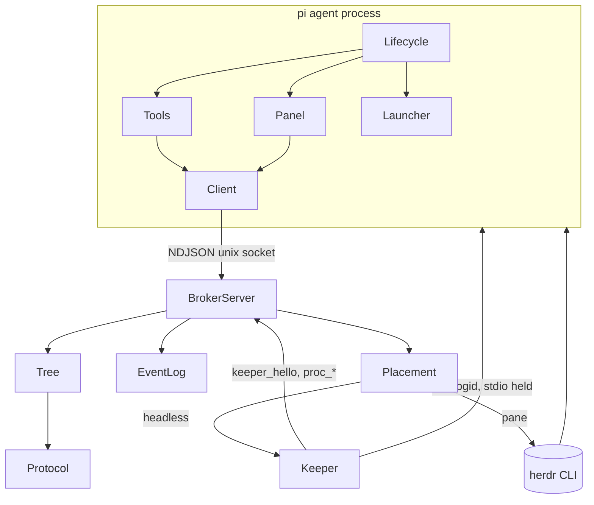

# pi-actors — Design (v5)

**Spec:** `specs/pi-actors.md` · **Frame:** default 3-layer split (domain / presentation / shell) plus the conventions of `~/work/pi-verified-goal`: TypeScript under `src/` with erasable syntax only, `node --test`, pi and `typebox` as `*` peers, extension tests through a fake pi host. · **Scope note:** one package on one machine (NFR-2). · **Revision:** v5 (2026-10-09) removes the human route (questions travel up the tree to the root's model), adds `forget` and the agents panel, quiets deliveries, and makes `/new` stop the tree; v3 addresses re-review findings S1–S5 and the round-2 P2/P3 items; v2 addressed R1–R21. The runtime claims were checked by `spike/` against real pi 1.0.3; results are under "Verification".

## Context and goals

pi agents spawn fresh or forked children on any model and exchange messages reliably (UC-1..10). The design copies the Erlang/OTP split:

- isolated processes with one mailbox each;
- one broker per agent tree, owning the registry, mailboxes, links and limits behind one Unix socket;
- a **Keeper** per headless child, owning the child's OS process and stdio;
- one pure **Tree** reducer whose events are written to an append-only log;
- identity passed as **pi CLI flags**, which subprocesses never inherit, and fenced by incarnation and pid.

The reducer's actions mirror a Quint model (`model/pi_actors.qnt`), and the model's invariants double as the reducer's property tests.

## Non-goals

- **Workflow engine or fan-out helpers.** Agents compose these from the primitives.
- **Presenting questions to the user.** The root's model decides how to ask; pi-actors only carries messages between agents.
- **Retries or model fallback inside agents.** The parent decides from the exit reason.
- **Cross-machine transport, and non-pi agents.** The protocol is versioned, so either stays a local addition later.
- **Deduplicating messages the model deliberately sends twice.** Only transport retries are deduplicated (spec INV-3).
- **Changes to pi-verified-goal.** That package only consumes the events listed under "Integration".
- **Defending against a malicious same-user process.** Same-user processes are trusted; accidental impersonation is not.

## Components

| Component    | Responsibility                                                                                                                                                                                                                                                                                                                              | Layer        | Depends on                | Interface                                                                         | Files                                                |
| ------------ | ------------------------------------------------------------------------------------------------------------------------------------------------------------------------------------------------------------------------------------------------------------------------------------------------------------------------------------------- | ------------ | ------------------------- | --------------------------------------------------------------------------------- | ---------------------------------------------------- |
| Protocol     | Frame types, `PROTO`, size limits, hand-written validators (no typebox), NDJSON codec                                                                                                                                                                                                                                                       | Domain       | —                         | `Frame`, `validate`, `encode`, `decode`, `LIMITS`                                 | `src/protocol.ts`                                    |
| Tree         | Pure reducer: agents, incarnations, mailboxes and leases, sender sequence numbers and the idempotency cache, limits, usage, exit reasons, forgotten ids                                                                                                                                                                                     | Domain       | Protocol                  | `apply(state, event): {state, effects}`; `initial(treeId)`; `recover(state, now)` | `src/tree.ts`                                        |
| EventLog     | Append-only log with a versioned header; fsync before responding, except lease events (`fetch`, `release`: `UNSYNCED_EVENTS` in `src/tree.ts`), which `recover` clears anyway; open cuts a torn or holed tail (only possible after the last fsync) back to the last good line; replay drops a cut-off final line; size-triggered compaction | Shell        | Protocol                  | `open`, `append`, `replay`, `compact`                                             | `src/broker/log.ts`                                  |
| BrokerServer | Socket server: binds connections to `(id, inc)`; heartbeats; time and sleep detection; runs `apply`, then performs effects; single-instance lock; writes `status.json`                                                                                                                                                                      | Shell        | Tree, EventLog, Placement | `node <runtime>/broker/main.ts <treeDir> <sock>`                                  | `src/broker/server.ts`, `src/broker/main.ts`         |
| Keeper       | Per headless child: spawns pi detached in its own process group with no shell; holds stdin open; drains stdout to a 64 KiB ring and auto-cancels extension dialogs; stderr to a capped file; reports `proc_start` and `proc_exit` (kept until acked); carries out `signal`                                                                  | Shell        | Protocol                  | `node <runtime>/keeper/main.ts <spec.json>`                                       | `src/keeper/main.ts`                                 |
| Placement    | Starts, signals and watches agents; owns the "is this pid the agent's process" check                                                                                                                                                                                                                                                        | Shell        | Protocol                  | `start(spec)`, `signal(id, sig)`, `watch(cb)`, `ownsPid(id, pid)`                 | `src/placement/headless.ts`, `src/placement/pane.ts` |
| Launcher     | Agent side: runtime snapshot, paths, node binary, starts or attaches to the broker                                                                                                                                                                                                                                                          | Shell        | Protocol                  | `ensureBroker(treeId)`                                                            | `src/client/launcher.ts`                             |
| Client       | Agent side: identity, hello, sender sequence numbers and retransmit, consumed-ID set, deferred ack                                                                                                                                                                                                                                          | Shell        | Protocol                  | `connect`, `request`, `on`                                                        | `src/client/connection.ts`                           |
| Tools        | The 3 model-facing tools (`spawn`, `send`, `stop`)                                                                                                                                                                                                                                                                                          | Presentation | Client                    | Tool contracts                                                                    | `src/index.ts`                                       |
| Panel        | Pure state machine for the agents panel: running agents, the collapsible ended row, clearing, pane focus, the scrolling transcript (read incrementally from the session file); the collapsed delivery line                                                                                                                                 | Presentation | Client                    | `items`, `press`, `view`, `readTranscript`                                        | `src/client/panel.ts`, `src/client/mailroom.ts`      |
| Lifecycle    | Extension wiring: flags, a guard against loading twice, session events, wake on mail, usage reporting, the delivery renderer, `/actors`                                                                                                                                                                                                     | Shell        | all client parts          | default export                                                                    | `src/index.ts`                                       |

### Runtime snapshot and launch (v3, R9/R15, operator N5/N13)

- **The snapshot.** On first spawn, Launcher copies `src/` into `~/.pi/agent/actors/runtime/<pkgver>-<contenthash>/`. That directory is outside `node_modules`, so Node strips types natively; no build step and no `dist/`. Every process in a tree runs from its tree's snapshot:

  - the broker, as `node <snap>/broker/main.ts`;
  - each Keeper, as `node <snap>/keeper/main.ts`;
  - every child pi, loaded with `-e <snap>/index.ts`.

  So `pi update` mid-run cannot mix versions. A spawn whose snapshot differs from the broker's PROTO fails fast with `proto_mismatch`.

- **Node binary.** Launcher uses `process.execPath` when its basename is `node`, otherwise `node` on `PATH`. If neither exists, it fails with `node_not_found`. Requires Node ≥ 22.18.

- **Loading twice (spike-verified):** pi exits at startup when two extensions register the same flag or tool. So the decision is made in the extension *factory*, from `process.argv`, before anything is registered:

  - if argv has `--actors-runtime=<path>` and `<path>` is not this module's own snapshot, this copy registers **nothing** and stays inert;
  - otherwise it is the active copy.

  Flag values themselves are read with `getFlag` at `session_start` or later. `getFlag` returns `undefined` inside the factory, but the values do survive a reload. Placement always passes flags as `--name=value`, so values starting with `-` parse.

### Identity (v3; replaces v2's environment variables)

- **Flags.** Lifecycle registers `--actors-runtime`, `--actors-tree`, `--actors-socket`, `--actors-id` and `--actors-inc`. Placement passes them to every child: on the command line for headless children, and after `--` in `herdr agent start` for pane children. Flags come from the process's own argv, so they survive a reload and are not inherited by `bash`, `pi` or `node` subprocesses (fixes S3, operator N1). (Spike-verified in RPC mode; TUI `/reload` takes the same `AgentSession.reload` path.)
- **No identity entries in sessions.** Flags make them unnecessary, which avoids the problem of a fork inheriting its parent's identity.
- **`hello{proto, id, inc, pid, session_id, session_file, cwd}`**:
  - **Child:** accepted only if `inc` is current, the agent isn't `down`, and `Placement.ownsPid(id, pid)` holds:

    - **headless:** the pid the Keeper reported in `proc_start`;
    - **pane:** on the first hello, `pid` must equal herdr's `foreground_process_group_id` for that pane, and is then recorded; later hellos must match the recorded pid.

  - **Root:** the root has no flags. Lifecycle stores `pi-actors-root{tree, socket, pid, session_id}` in the root session. A hello as `root` is accepted when either:

    - the pid equals the recorded pid (a reload), or
    - the session ID equals the recorded one **and** the recorded pid is dead (`pi --continue` after a crash).

    A `/fork` or `/tree` copy of the root session has a different session ID, so it is rejected (fixes S4).
- **Supersede.** A second accepted hello for the same incarnation and pid supersedes the old connection, which gets `superseded` and goes inert. A rejected hello gets `identity_rejected{reason}`, and that client disables its tools.
- **Session switches.** In a child, `session_shutdown{new|resume|fork}` makes it `exit` with `error:session_switched`. Its identity is bound to its session file. In the root, a switch sends a new `hello` with the new session and rewrites `pi-actors-root` into the new session.

### Frames

| Frame                                     | Direction     | Fields                                                   | Response                                                                                                                                                                                                                                                            |
| ----------------------------------------- | ------------- | -------------------------------------------------------- | ------------------------------------------------------------------------------------------------------------------------------------------------------------------------------------------------------------------------------------------------------------------- |
| `hello`                                   | agent→broker  | `proto, id, inc, pid, session_id, session_file, cwd`     | `welcome{last_seq, mailbox_count}` · `superseded` · `identity_rejected{reason}` · `proto_mismatch`                                                                                                                                                                  |
| `keeper_hello`                            | keeper→broker | `proto, id, inc, keeper_pid`                             | `welcome`                                                                                                                                                                                                                                                           |
| `bye`                                     | agent→broker  | `reason: reload\|quit`                                   | —                                                                                                                                                                                                                                                                   |
| `hb`                                      | both          | `usage?`                                                 | `hb`                                                                                                                                                                                                                                                                |
| `spawn`, `send`, `exit`, `kill`, `forget` | agent→broker  | all carry `seq`; plus the operation's own fields (below) | the response, idempotent per `(sender, inc, seq)`                                                                                                                                                                                                                   |
| `fetch`                                   | agent→broker  | `fetch_id, kind?, from?, tag?, ref?`                     | `message{msg_id, from, kind, body, tag?, ref?}` (now leased) · `none`                                                                                                                                                                                               |
| `ack`                                     | agent→broker  | `msg_id`                                                 | — (consumes the message)                                                                                                                                                                                                                                            |
| `release`                                 | agent→broker  | `msg_id`                                                 | — (returns a lease)                                                                                                                                                                                                                                                 |
| `mail`                                    | broker→agent  | `count, urgent`                                          | —                                                                                                                                                                                                                                                                   |
| `terminate`                               | broker→agent  | `reason`                                                 | the agent runs `ctx.abort()`, then shuts down: `process.kill(process.pid, "SIGTERM")` in RPC mode, because `ctx.shutdown()` does not take effect while an RPC pi is idle (spike); `ctx.shutdown()` in TUI. Exit code 143 after a `terminate` counts as a clean exit |
| `signal`                                  | broker→keeper | `sig: TERM\|KILL`                                        | —                                                                                                                                                                                                                                                                   |
| `proc_start` / `proc_exit`                | keeper→broker | `pid, pgid` / `code, signal`                             | `proc_exit` is acked (`ack_exit`)                                                                                                                                                                                                                                   |
| `inspect`                                 | any→broker    | `subtree?`                                               | snapshot                                                                                                                                                                                                                                                            |
| `stop_tree`                               | root→broker   | —                                                        | kill everything, compact, exit                                                                                                                                                                                                                                      |

**Operation fields:**

- `spawn{name?, task, model?, thinking?, context, cwd?, placement, limits?, timeout_s?, resume?}` → `spawned{id, inc}`
- `send{to, kind: mail, body, tag?, ref?, urgent?}` → `accepted{msg_id}`; `ref` is the message being answered (`reply_to`)
- `exit{result, truncated}` → `ok`
- `kill{id, reason?}` → `ok`
- `forget{target}` → `ok` (v5; see "Forget")

`PROTO` is 2 since v5: the `call` and `reply` kinds and the `answer` op are gone, so a v1 client is refused with `proto_mismatch`. Message kinds are `mail` and `down`.

**Sequence numbers.** Every frame with a `seq` is logged, including rejected ones; the rejection is its logged outcome. Rules:

- `seq = last + 1`: applied;
- `seq ≤ last`: returns the cached response from the last 256 seqs;
- `seq > last + 1`: `seq_gap`.

A reload loses the unaccepted frames held in memory. A tool interrupted by the reload reports `interrupted{seq}` to the model, and the model's own retry is a new message (spec INV-3).

**Errors:** `unknown_target`, `target_down`, `mailbox_full`, `limit_depth`, `budget_exhausted`, `not_authorized`, `no_session_file`, `herdr_unavailable`, `seq_gap`, `too_large`, `bad_request`, `proto_mismatch`.

**Message IDs:** `"<sender>:<inc>:<seq>"`. Broker-made messages (DOWN) are `"broker:<n>"`.

### Agent status machine (v3)

| From                                                              | Trigger                                                          | To                                                 | Effects                                                                    |
| ----------------------------------------------------------------- | ---------------------------------------------------------------- | -------------------------------------------------- | -------------------------------------------------------------------------- |
| —                                                                 | `spawn` admitted                                                 | `starting(start_deadline)`                         | `start` (never re-executed on replay); the task is enqueued                |
| `starting`                                                        | accepted `hello` (headless: held until `proc_start` has arrived) | `live`                                             | —                                                                          |
| `starting`                                                        | `start_deadline` passes                                          | `killing` → `down(error:start_timeout)`            | —                                                                          |
| `live`                                                            | EOF, or no heartbeat for 45 s                                    | `disconnected(until = now + G)`                    | —                                                                          |
| `disconnected`                                                    | accepted `hello`                                                 | `live`                                             | —                                                                          |
| `disconnected`                                                    | `until` passes                                                   | `killing` → `down(lost)`                           | —                                                                          |
| `live`/`disconnected`                                             | `exit`                                                           | `exiting(deadline 10 s)` with the result stored    | `terminate`                                                                |
| `exiting`                                                         | `proc_exit` or deadline                                          | `down(normal\|error per the exit frame)`           | `signal KILL` if no `proc_exit` yet                                        |
| `exiting`                                                         | `kill`                                                           | stays `exiting`                                    | ignored; the stored result is kept                                         |
| non-down, not exiting                                             | `kill` by an ancestor or the root                                | `killing(t0)`                                      | `terminate`; `signal TERM` at t0 + 5 s; `signal KILL` at t0 + 10 s         |
| `killing`                                                         | `proc_exit`                                                      | `down(killed\|<carried reason>)`                   | —                                                                          |
| `killing`                                                         | t0 + 15 s with no `proc_exit`                                    | `down(killed, unconfirmed)`                        | warning in `status.json`                                                   |
| non-down                                                          | `proc_exit` with no `exit` or `kill`                             | `down(error:crashed(code))`                        | —                                                                          |
| keeper connection lost, then the agent's own connection also lost | —                                                                | `down(error:keeper_lost)`                          | the child dies when its stdin closes; the broker signals the pgid directly |
| non-down                                                          | `timeout_s` passes (active time)                                 | `killing` → `down(timeout)`                        | —                                                                          |
| non-down                                                          | parent becomes `down`                                            | `killing` with carried reason `killed:parent_down` | link rule                                                                  |
| `down`                                                            | `spawn{resume}` by the parent                                    | `starting` with `inc + 1`                          | only once Placement confirms the process is gone; at most 3 resumes        |
| `down`, with every descendant `down`                              | `forget` by a strict ancestor                                    | removed; the id is retired                         | its mailbox, leases and seq entries go too (v5)                            |

- **Exactly one DOWN.** Entering `down` emits exactly one DOWN, `broker:<n>`, carrying `{id, inc, reason, result ≤ 64 KiB (truncation marked), usage}`.
- **G** is 60 s for a child and 300 s for the root, counted from detection. The kill sequence takes at most 15 s, which gives the spec's G + 15 s.

### Time and sleep (v3, operator N4, tester N7)

- BrokerServer samples both the wall clock and the monotonic clock every second. On macOS the monotonic clock pauses during sleep, so `wall_delta − mono_delta > 5 s` means the machine slept for that difference.
- After a sleep it applies `slept{duration}`, and Tree shifts every *active-time* deadline (`disconnected.until`, `start_deadline`, `timeout_s`, `killing` and `exiting` deadlines) by exactly that duration. Grace is extended by the sleep, not reset, so an agent that is really dead still goes down within G of real activity (fixes the "reset for everyone" issue).
- Apart from `slept`, Tree sees time only through the `now` field logged on each event.

### Tool contracts (v4: three tools, push delivery — per user direction; v5: no human route)

Three single-purpose tools. Everything the model needs to *know* arrives by push; tools exist only for things the model *does*. Replaces v3.2's four pull-based tools (`receive`, `exit`, the `expect_reply` flag), and the blocking `ask` considered in between: an answer is just another pushed message.

| Tool    | Params                                                                                          | Result                                                                                      |
| ------- | ----------------------------------------------------------------------------------------------- | ------------------------------------------------------------------------------------------- |
| `spawn` | `task, name?, model?, thinking?, fork?: bool, cwd?, pane?: bool, timeout_minutes?, resume?: id` | `{id}` immediately; never blocks. The child's reports arrive later by push                  |
| `send`  | `to: id \| "parent", text, reply_to?, urgent?`                                                  | `{msg_id}` once durably accepted. `reply_to` marks the message as an answer to that message |
| `stop`  | `id`                                                                                            | Descendants only. Returns once the agent is down                                            |

**Pushed into the conversation** (one coalesced entry per delivery, labelled by sender, never as user input):

- messages and answers from other agents (`reply_to` shown);
- a **report** each time a child finishes a run: its final answer (≤ 16 KiB inline; longer answers say where the full text is);
- DOWN notices with the reason. Since v5 a DOWN the agent caused itself is acked without being shown: `killed` (or `killed:unconfirmed`) for an id it stopped with `stop` or `/actors stop <id>`, and `killed:tree_stopped`. Unexpected ends (`error`, crashes, `timeout`, `lost`, start failures) are still pushed.

**Formatting (v5).** A delivery is the messages alone, one `■` block each (`Task from …`, `Report from …`, `X answered your msg …`, `X ended: …`); there is no `[pi-actors] N updates` header and no "Reply with send{…}" footer. That guidance lives once in the `send` tool's `promptGuidelines`, with the escalation rule: answer a child from your own context if you can, otherwise forward the question to your parent (quoted, naming the asker), or, with no parent, ask the user, then answer with `reply_to`. In the TUI a delivery renders through `registerMessageRenderer` as one dim line (`⇢ report from X · …`) that expands to the full text the model read.

Delivery: idle agent → `sendMessage(..., {triggerTurn: true})`; busy agent → `deliverAs: "followUp"`, or `"steer"` when `urgent`. **Waiting** is ending the turn; pushes wake the agent. **A child's result** is simply its final answer — no `exit` tool, no done-nudge (D10 is superseded). A finished child is idle but alive; `send` continues it; it ends when stopped, when its parent goes down, or when the tree stops.

**Exactness is kept (D3 revised):** every pushed entry carries `details.actors = {id, consumed: [msg_id…]}`. The client leases the messages it fetches, injects them, and acks them once the entry is persisted (checked at `turn_end` and `agent_settled`); the consumed set is rebuilt from session entries on reload, and IDs still being delivered are skipped (the property-tested in-flight dedupe). All messages are `mail` with an optional `ref` (v5; before, a question to the human was a `call` frame).

**Goal integration:** the extension emits `actors:waiting {waiting, children}` on `pi.events` — `waiting` is true while the agent has a direct child that has not reported since it was last addressed. pi-verified-goal does not continue (and does not count a stall) while waiting; the next push wakes the agent.

## Spec traceability

| Spec element         | Owning component                                                                                                                                                             | Notes (what breaks if removed)                                                                                                                     |
| -------------------- | ---------------------------------------------------------------------------------------------------------------------------------------------------------------------------- | -------------------------------------------------------------------------------------------------------------------------------------------------- |
| UC-1 fresh spawn     | Tree                                                                                                                                                                         | Limits and identity are bypassed                                                                                                                   |
| UC-2 fork spawn      | Placement                                                                                                                                                                    | Runs `pi --mode rpc --fork <session_file> -e <snap>/index.ts --actors-… --model … --thinking …` in `cwd`; `no_session_file` if the parent has none |
| UC-3 send/reply      | Tree                                                                                                                                                                         | No routing, correlation or authorization                                                                                                           |
| UC-4 receive + wake  | Client                                                                                                                                                                       | No consumption; idle agents never wake                                                                                                             |
| UC-5 exit → DOWN     | Tree                                                                                                                                                                         | Results and failures are invisible                                                                                                                 |
| UC-6 escalation      | Tools (`send` `promptGuidelines`) + the root's model                                                                                                                         | Questions stop at an agent that cannot decide (v5: there is no `human` address by design)                                                          |
| UC-7 kill            | Tree + Keeper/Placement                                                                                                                                                      | Runaways need manual killing                                                                                                                       |
| UC-8 resume          | Tree + Placement (`--session <stored file>` plus the recorded `--model` and `--thinking`, because the session file keeps the original model; a pane resume opens a new pane) | Identity churn                                                                                                                                     |
| UC-9 inspect, clear  | Panel + Lifecycle `/actors` + Tree `forget` + BrokerServer `status.json`                                                                                                     | The tree is opaque, or ended agents pile up                                                                                                        |
| UC-10 `/new`         | Lifecycle (`session_shutdown{new}` → `stop_tree`, carry file dropped)                                                                                                        | A new session silently inherits the old tree                                                                                                       |
| INV-1                | Tree (status machine, link rule)                                                                                                                                             | Orphans                                                                                                                                            |
| INV-2                | Tree (`down` is final; one DOWN per incarnation)                                                                                                                             | Duplicated or missing results                                                                                                                      |
| INV-3                | Client (deferred ack, consumed IDs) + Tree (seq dedupe, leases) + EventLog (bodies until ack)                                                                                | Duplicates or loss                                                                                                                                 |
| INV-4                | Tree (seq order)                                                                                                                                                             | Reordering                                                                                                                                         |
| INV-5                | Tree                                                                                                                                                                         | Unbounded fan-out                                                                                                                                  |
| INV-6                | Tree                                                                                                                                                                         | Silent sends to agents that are gone                                                                                                               |
| INV-7                | Tree (`disconnected`) + Lifecycle (flags)                                                                                                                                    | A reload kills the subtree                                                                                                                         |
| INV-8                | Tree (mailbox, DOWN reserve) + Protocol (frame limit)                                                                                                                        | Floods                                                                                                                                             |
| INV-9                | Placement                                                                                                                                                                    | Divergent semantics                                                                                                                                |
| INV-10               | Placement `ownsPid` + Tree (root session fence) + Lifecycle (flags)                                                                                                          | Identity theft                                                                                                                                     |
| INV-11               | Tree (`forget` guard, `forgotten` ids)                                                                                                                                       | A live agent erased, or a lingering process claiming a new agent's id                                                                              |

## Data flow

**Send → receive (INV-3/4; S1 fixed)**

1. The sender sends `send{seq: n}`. The broker applies it, appends and fsyncs, then replies `accepted`. Retransmits are deduplicated by seq.
1. The receiver gets a `mail` notice. `receive` sends `fetch`; the message is leased to this `fetch_id`.
1. Client checks the consumed-ID set (rebuilt from `sessionManager.getEntries()` where `details.actors.id` equals its own ID; `getEntries` is append-only and survives compaction). If the ID is there, Client acks it and fetches again. Client also skips an ID it is *still delivering* (handed to a tool result that is not yet persisted): after a broker restart the lease is gone and the same message can be fetched a second time. (Found by the Tree property test; the model has a scenario for it.)
1. The tool result carries `details.actors = {id, consumed: [msg_id]}`. Client queues the `msg_id` as *pending ack*.
1. **The ack is sent at `turn_end`, for the entries listed in its `toolResultEntryIds`.** The spike showed tool results are not yet persisted at `tool_result`, `tool_execution_end` or `message_end`, and are persisted (in memory and on disk) from `turn_end` on. Pending acks are kept in memory; a reload before the ack causes a redelivery, which step 3 deduplicates.

**Questions for the human (v5; replaces "Call and human")**

1. A child that needs a decision sends it to `"parent"` as ordinary mail.
1. The parent answers from its own context if it can. Otherwise it forwards the question to its own parent, quoting it and naming the asking agent, and later relays the answer down with `reply_to`.
1. The root's model asks the user however it chooses (its own question tool, plain text) and sends the answer back with `reply_to`.

Why: the parent briefed the child and usually holds the answer; the user hears one voice, from the session they are talking to; presentation belongs to that interactive session, not to pi-actors; and it removes the only obligation that could stay outstanding for hours (24 h call timeouts, withdrawal on every outcome, answer authorization). The cost is one model turn per relay level. A pane child can still be talked to directly in its pane.

**Forget (v5)**

- `forget{target}` is sequenced and logged like any op. The sender must be a strict ancestor of the target, and the target and every descendant must be `down` (`bad_request: still running` otherwise).
- It removes the target and its subtree from agents, mailboxes, leases and sender-seq tracking, and appends their ids to `forgotten`. A forgotten id is never reused by `spawn` (a kill that was `unconfirmed` may leave a process alive), a `hello` claiming it is rejected (`unknown`), and a `send` to it fails with `unknown_target`.
- Unread mail queued for a forgotten agent is dropped with it; DOWN notices already queued for the parent stay. The model's at-least-once invariant exempts the forgotten agent.
- A snapshot written before v5 has no `forgotten` field; `apply` normalizes it to `[]`.
- The panel's `x` and `/actors clear` call it on the tops of the ended subtrees.

**Reload, quit, crash (operator N3)**

- **Reload:** `bye{reload}`, the agent becomes `disconnected`, and the same pid's `hello` supersedes the old connection.
- **Root `session_shutdown{quit}`:** pi can't tell `/quit` from SIGHUP. So it sends `bye{quit}`, the root becomes `disconnected` with its 300 s grace, and the tree keeps running. Closing the root terminal by accident then costs nothing if you return within 300 s.
- **Stopping a tree** is only ever explicit: `/actors stop`, or `/new` in the root (v5), both of which send `stop_tree`. On `/new` the carried tree id is dropped too, so the new session starts a fresh tree on its first spawn. `/resume`, `/fork` and reload still keep the tree.

**Broker crash and replay (S5 fixed)**

1. Clients and Keepers reconnect with backoff for up to G.
1. The root's Launcher relaunches the broker (D13 lock).
1. Replay rebuilds state and then runs `Tree.recover(state, now)`:
   - `live` becomes `disconnected(now + G)`;
   - `starting`, `exiting` and `killing` keep their status and deadlines, shifted by the broker's downtime;
   - kill sequences are re-issued (signals are idempotent);
   - `start` effects are **never** re-executed;
   - a sweep sends any non-down agent whose parent is `down` into `killing` with `killed:parent_down`.
1. Keepers send `keeper_hello` and then their retained `proc_start` / `proc_exit`.

## State ownership

| State                                                                                                          | Owner                                                | Mutated by         | Source of truth                                                     |
| -------------------------------------------------------------------------------------------------------------- | ---------------------------------------------------- | ------------------ | ------------------------------------------------------------------- |
| Agents (status, inc, parent, limits, session ID and file, cwd, model, placement, recorded pid, resumes, usage) | Tree                                                 | `apply`, `recover` | EventLog                                                            |
| Mailboxes and reserves, leases, `last_seq`, idempotency cache, spawn counters, forgotten ids                   | Tree                                                 | `apply`            | EventLog; leases are dropped on replay because connections are gone |
| Connections, heartbeats, clocks                                                                                | BrokerServer                                         | BrokerServer       | Memory                                                              |
| Child process, stdio, pgid                                                                                     | Keeper (headless) / herdr (pane)                     | Keeper / herdr     | OS / herdr                                                          |
| Consumed IDs, pending acks                                                                                     | Client                                               | Client             | The session's entries / memory                                      |
| Root fence `{pid, session_id}`                                                                                 | Tree (registry) + Lifecycle (`pi-actors-root` entry) | `hello`            | EventLog                                                            |
| Broker lock                                                                                                    | Launcher                                             | O_EXCL create      | `broker.lock` holding `{pid, boot_time}`                            |

## Decisions

### D1: One broker per tree

- **Driver:** INV-7, INV-3, INV-1.
- **Alternatives:**
  - a socket server in each agent's extension: dies on reload;
  - one broker per user: a fault would cross unrelated trees.
- **Reversibility:** costly.
- **Validated by:** `test/reload.test.ts`.

### D2: Pure Tree reducer plus an event log; replay runs `recover`, never `start`

- **Driver:** INV-2, INV-3, NFR-3.
- **Alternatives:** a mutable store such as one JSON file per mailbox (not atomic); `node:sqlite` (still experimental, and the broker is the only writer anyway).
- **Reversibility:** cheap.
- **Validated by:** `test/tree.property.test.ts`: replay plus `recover` equals the live state followed by `recover`; one DOWN per incarnation; no `start` on replay. This is the corrected form of the v2 property.

### D3: Pull consumption, with the ack deferred until the result is persisted (S1)

- **Driver:** INV-3.
- **Alternatives:** acking from `message_end`. Rejected after verification: pi calls extension `message_end` handlers *before* `appendMessage` (`agent-session.js:735-751`).
- **Reversibility:** cheap.
- **Validated by:**
  - `spike/ack-order` against real pi;
  - `test/delivery.test.ts` with a fake host that reproduces pi's real event order.

### D4: Liveness from socket and heartbeat, plus sleep compensation

- **Driver:** INV-1, INV-6.
- **Alternatives:**
  - PID polling: reused PIDs and zombies;
  - "timer fired late" sleep detection: the monotonic clock pauses on macOS.
- **Reversibility:** cheap.
- **Validated by:** `test/clock.test.ts` with fake wall and monotonic clocks: a 1 h sleep shifts deadlines by exactly 1 h, and a dead agent still goes down within G of active time.

### D5 — [SUPERSEDED by D8] · D7 — [SUPERSEDED by D10]

### D6: The human is an addressable pseudo-agent — [REVERSED 2026-10-09, v5]

- **Was:** `send{to: "human"}` made a `call` listed in the root's panel (or the asker's pane), answered with choices, `/inbox` and `/answer`, with herdr marks and tmux bells.
- **Now:** there is no `human` address. Questions travel up the tree as mail and the root's model asks the user (Data flow, "Questions for the human"). Reason: the parent has the context, the user hears one voice, the interactive session owns presentation, and the protocol loses its only long-lived obligation.

### D8: A Keeper per headless child (v3 detail: separate pgid, stdout ring, dialog auto-cancel, retained `proc_exit`, broker signals the pgid directly if the Keeper is gone)

- **Driver:** INV-1, INV-7, operator N2/N6/N11, implementer N5/N10.
- **Alternatives:** `sh -c 'sleep inf | exec pi'`, which leaves process exit unowned; a PTY, which needs native code.
- **Child environment:** inherits everything except `HERDR_*`, so a headless child can't report itself as the root's pane. An allowlist was rejected because it would drop provider API keys.
- **Reversibility:** cheap.
- **Validated by:** `test/broker-crash.test.ts` (a fake agent runs under a real Keeper; SIGKILL the broker and restart it) and `spike/rpc-dialog` (a dialog is cancelled, not hung).

### D9: Mailbox bounds (internal safety constants, not user-facing settings)

- **Decision:**
  - ordinary messages: 200 or 2 MiB per agent;
  - DOWN notices: their own reserve of 400 per agent. Space is held when the DOWN is *caused*: a spawn holds one DOWN slot in the parent's mailbox. A DOWN therefore always has room, and the spawn is rejected up front instead (`mailbox_full`). (Until v5, call replies and human answers shared this reserve.)
- **Driver:** INV-8, INV-2 (a DOWN must never be dropped).
- **Alternatives:** a cap on pending calls per caller (v3 draft). Rejected: another workload parameter; the reserve bounds the same thing with no new knob.
- **Validated by:** `test/tree.property.test.ts`: neither class exceeds its bound, and an exempt message is never rejected.

### D10: Done-nudge — [SUPERSEDED by v4: a child's final answer is its report; there is no exit tool to forget]

### D11: Identity via CLI flags; incarnation; `ownsPid`; root session fence (v3, supersedes v2's environment approach)

- **Driver:** INV-10, INV-7.
- **Alternatives:**
  - environment variables plus scrubbing (v2): lost on reload, and leaked through a pane's shell;
  - a token stored in the session: inherited by forks.
- **Reversibility:** cheap.
- **Validated by:**
  - `test/identity.test.ts`: a foreign pid is rejected; the same pid supersedes; a forked root session is rejected; `--continue` takes over only when the recorded pid is dead; a stray `pi` in a pane has no flags;
  - `spike/flags-reload`.

### D12: Versioned protocol and log; a runtime snapshot instead of a build (v3, supersedes v2's `dist/`)

- **Driver:** NFR-1, operator N5 (`pi update` mid-run, local-path installs).
- **Alternatives:** compiling to `dist/` in `prepack`. Rejected: no `dist/` exists for local-path installs, and `pi update` overwrites it.
- **Reversibility:** cheap.
- **Validated by:** `test/launch.test.ts`: install into a temporary `node_modules`, take a snapshot, start broker and Keeper from the snapshot; and a check that the snapshot is unchanged after the package files are modified.

### D13: Paths, single instance, retention

- **Decision:**
  - socket at `/tmp/pia-<uid>/<tree8>.sock` in a `0700` directory; a launch fails if the path is over 104 bytes;
  - tree directory at `~/.pi/agent/actors/<tree8>/`;
  - the broker lock holds `{pid, boot_time}`. A lock counts as stale when connecting to the socket fails **and** its `boot_time` predates the last boot, or its pid is dead (operator N7);
  - compaction above 8 MiB;
  - the 5 most recent stopped trees are kept;
  - snapshot directories with no running tree are removed when a broker starts;
  - the launcher touches the socket path every hour, so macOS's periodic `/tmp` cleanup doesn't remove it.
- **Validated by:** `test/launch.test.ts` (two concurrent launchers produce one broker; a stale lock after a "reboot" is replaced) and `test/log.test.ts`.

### D14: Only two limits: nesting depth and spawn count (v3, per user direction)

- **Decision:**

  - `max_depth`: default 2;
  - `max_spawns`: total spawns in the tree, counting resumes, default 40.

  Both come from settings (`piActors.maxDepth`, `piActors.maxSpawns`) or `/actors limits`. A `spawn{limits}` may only *tighten* them for the child's subtree: that subtree's spawns count against both its own cap and every ancestor's.

- **Driver:** INV-5. Both limits are workload-independent. Depth bounds recursion; the spawn count bounds total cost and total processes.

- **Alternatives:** caps on live children, live agents or pending calls, and budgets per root child (v2/v3 drafts). Rejected: they encode one workflow's shape (a backlog coordinator) and make other workflows tune knobs that don't protect anything the two limits don't.

- **Reversibility:** cheap.

- **Validated by:** `test/tree.property.test.ts`: admission never exceeds either limit at any level, and a subtree's limits are never looser than its ancestors'.

### D15: The Quint model is the source of truth for Tree's actions

- **Decision:** `model/pi_actors.qnt` models agents, the broker (crash, replay), connections (reload, supersede), Keepers, leases, sequence numbers, parallel fetches and (v5) `forget`; `model/pi_actors_identity.qnt` models identity: pid ownership, incarnations, the root fence, session switches and `--continue` takeover. Tree's `apply` cases correspond one-to-one to the model's actions, and the model's invariants are re-implemented as property tests on Tree.
- **Driver:** INV-1..4, INV-10; review rounds 1 and 2 both found interleaving bugs by hand.
- **Alternatives:**
  - Lean proofs: weeks of proof engineering for a protocol that is still changing;
  - property tests only: they explore the implementation, not the design.
- **Reversibility:** cheap.
- **Validated by:** `npx quint run --invariant=…` (random simulation, ≥ 10k traces per invariant). Exhaustive bounded checking with `quint verify` (Apalache) needs Java, which isn't installed here (follow-up).

## Integration

- **pi-verified-goal:**
  - Lifecycle emits `actors:activity` (spawn, receive) and `actors:usage{delta}` (on DOWN).
  - `/actors stop [id]` is a *command*, so it still works when the goal's budget has blocked all tools (operator N8).
  - `actors:waiting {waiting, children}` holds the goal loop while direct children owe a report.
- **herdr:**
  - Placement polls a single `herdr pane list` every 5 s, and treats a pane that vanished as `proc_exit(killed:pane_closed)`.
  - Placement closes the panes it created when their agent goes down.
  - Pane children receive their identity as flags passed after `--` to `herdr agent start`.
  - The panel's `f` runs `herdr agent focus <name>` (or `tmux select-window`/`select-pane`) for a running pane agent and reports a failure; for an ended or headless agent it says why there is nothing to focus. Keys are matched with `matchesKey`, because under the kitty keyboard protocol a plain letter arrives as an escape sequence (v5; `f` did nothing before).

## Failure modes and cross-cutting concerns

| Scenario                                     | Behaviour                                                                                                                                                                  | Owner                  |
| -------------------------------------------- | -------------------------------------------------------------------------------------------------------------------------------------------------------------------------- | ---------------------- |
| Broker crash                                 | Replay plus `recover`; headless children survive; Keepers report retained exits; no `start` is replayed.                                                                   | EventLog, Tree, Keeper |
| Keeper crash                                 | The child's stdin closes and pi exits; the broker signals the recorded pgid; `down(error:keeper_lost)`.                                                                    | Tree, Placement        |
| Crash before an ack                          | Redelivered, then deduplicated by the consumed-ID set.                                                                                                                     | Client                 |
| Two parallel `receive`s                      | Sequential execution, plus leases.                                                                                                                                         | Tools, Tree            |
| A stray `pi` in a pane after the child quits | It has no flags, so it isn't an actor.                                                                                                                                     | Lifecycle              |
| A forked or `--continue`d root session       | The session-ID and dead-pid fence.                                                                                                                                         | Tree                   |
| Root terminal closed (SIGHUP)                | The root becomes `disconnected` for 300 s; children keep working; `pi --continue` reattaches.                                                                              | Lifecycle, Tree        |
| Laptop sleep                                 | Deadlines shift by the slept duration.                                                                                                                                     | BrokerServer, Tree     |
| `pi update` mid-tree                         | The tree keeps running from its snapshot; new trees use a new snapshot.                                                                                                    | Launcher               |
| An extension dialog in a headless child      | The Keeper cancels it automatically.                                                                                                                                       | Keeper                 |
| Retransmitted `exit`, `kill` or `forget`     | Gets the cached original response.                                                                                                                                         | Tree                   |
| `kill` during `exiting`                      | Ignored; the result is kept.                                                                                                                                               | Tree                   |
| A child switches sessions                    | `exit error:session_switched`.                                                                                                                                             | Lifecycle              |
| The goal's budget blocks tools               | `/actors stop` still works.                                                                                                                                                | Lifecycle              |
| Many children with questions at once         | Each reaches its parent as mail; the root's model batches and asks the user.                                                                                               | Tools, root model      |
| Ended agents pile up in a long session       | The panel collapses them into one ended row; `x` or `/actors clear` forgets them; `/new` stops the tree.                                                                  | Panel, Tree            |
| Clearing an agent whose exit was unconfirmed | Its id is retired, so a lingering process cannot reconnect or be mistaken for a new agent.                                                                                 | Tree                   |
| Observability without a live root            | `status.json`, written by the broker (throttled to once a second).                                                                                                         | BrokerServer           |
| Disk growth                                  | Log compaction; capped stderr; stdout kept only in memory; retention of 5 trees. Child session files in `~/.pi/agent/sessions` are pi's to manage, and documented as such. | EventLog, Keeper       |

## Verification

1. **Model** (`model/pi_actors.qnt`): random simulation of every invariant. Counterexamples become Tree regression tests.
1. **Spike** (`spike/`, real pi 1.0.3, pi-ai's scripted provider, no model calls). Results, 2026-10-05:
   - `ack-order`: tool results are persisted from `turn_end` on, not at `message_end` → ack at `turn_end` (D3).
   - `parallel-tools`: tools in one message run concurrently by default; one sequential tool serializes the whole batch → leases instead of sequential tools.
   - `flags-reload`: flag values survive reload and are not inherited; duplicate or unknown flags are fatal; `getFlag` is empty inside the factory → the double-load rule decides from argv.
   - `rpc-dialog`: a dialog blocks until stdin answers; `{"cancelled": true}` resolves it; abort does not → the Keeper auto-cancels (D8).
   - `rpc-terminate`: `ctx.shutdown()` doesn't take effect while idle; self-SIGTERM exits with 143 after a clean `session_shutdown`; stdout is not flushed → `terminate` uses SIGTERM, and stdout is never relied on.
   - `stdin-eof`: closing stdin exits pi in ~7 ms → Keeper loss kills the child, as designed.
   - `fork-model`: `--fork` with another `--model` works; the new session's cwd is the process cwd → UC-2 holds; resume passes `--model` again.
1. **Tree property tests** mirror the model's invariants (D15).

## Implementation verification (v0.1.0, 2026-10-05)

- `npm test` (37): reducer scenarios and properties (3,000 random executions × 150 steps against the model's invariants), push delivery, conformance, and model-free broker integration (real broker and Keepers with fake agents, including a broker SIGKILL mid-run).
- `npm run test:live` (3, real pi 1.0.3, scripted provider): a spawn → report → follow-up → report → stop round trip; a fork that sees the parent's conversation on another model; a herdr pane child (inside herdr only). Also run against the packed tarball installed in `node_modules`.
- `npm run model`: 6 scenarios, random simulation, 5 witnesses, 6 mutants (all caught).
- Bugs found during implementation and fixed: `recover` was not logged (second restart); in-flight double consumption across a broker restart; `welcome` delivering before the client was stored; built-in pi options rejecting `--name=value`; herdr's `process-info` syntax and agent-name rules; a pane child's hello arriving before its pane was recorded.

## Conformance rules (machine-checkable; `test/conformance.test.ts`)

- `src/protocol.ts` and `src/tree.ts` import nothing except each other.
- `src/broker/**`, `src/keeper/**` and `src/placement/**` import no `typebox` and no `@earendil-works/*`.
- `src/client/**` imports only `src/protocol.ts` from the core.
- Only `src/broker/server.ts` imports `src/placement/**`.
- Every `src/**/*.ts` uses erasable syntax only (`tsc --erasableSyntaxOnly`), so the runtime snapshot runs under Node type stripping.
- `package.json` has no `dependencies`; host packages appear only as `"*"` peers.

## Confirmed defaults

User-confirmed 2026-10-05: G = 60 s for children and 300 s for the root; only two limits, max depth (2) and spawn count (40 per tree), both configurable; mailbox safety caps of 200 messages / 2 MiB of ordinary mail per agent, with a 400-slot reserve for DOWN notices.

## Decisions recorded at release (2026-10-05)

- **Root grace stays 300 s.** A reload needs seconds; the case it serves is an accidentally closed terminal, recovered with `pi --continue`. The cost is bounded (children finish assigned work for at most 5 minutes), and deliberate stops are immediate via `/actors stop`.
- **`spike/` stays in the repository, outside the npm package.** It is the evidence for the runtime assumptions under "Verification", and it is re-runnable against future pi versions, which is when those assumptions need re-checking.

## Revision log

| Finding                                                                          | Resolution                                                                                                                                                                                                                                                                                                                                                                                                                                                                                                                                                                                                                                                                                                                                                                                                                                                                                                                                                                                                                                                                                                                                                                             |
| -------------------------------------------------------------------------------- | -------------------------------------------------------------------------------------------------------------------------------------------------------------------------------------------------------------------------------------------------------------------------------------------------------------------------------------------------------------------------------------------------------------------------------------------------------------------------------------------------------------------------------------------------------------------------------------------------------------------------------------------------------------------------------------------------------------------------------------------------------------------------------------------------------------------------------------------------------------------------------------------------------------------------------------------------------------------------------------------------------------------------------------------------------------------------------------------------------------------------------------------------------------------------------------- |
| R1–R21 (round 1)                                                                 | See v2 (commit `34c98a8`); items changed again in v3 are listed below                                                                                                                                                                                                                                                                                                                                                                                                                                                                                                                                                                                                                                                                                                                                                                                                                                                                                                                                                                                                                                                                                                                  |
| S1 ack before persist                                                            | D3, Data flow step 5                                                                                                                                                                                                                                                                                                                                                                                                                                                                                                                                                                                                                                                                                                                                                                                                                                                                                                                                                                                                                                                                                                                                                                   |
| S2 parallel receive / stolen reply                                               | Tool contracts (sequential execution, reply exclusion), leases                                                                                                                                                                                                                                                                                                                                                                                                                                                                                                                                                                                                                                                                                                                                                                                                                                                                                                                                                                                                                                                                                                                         |
| S3 identity lost on reload                                                       | Identity: CLI flags (D11)                                                                                                                                                                                                                                                                                                                                                                                                                                                                                                                                                                                                                                                                                                                                                                                                                                                                                                                                                                                                                                                                                                                                                              |
| S4 root and pane takeover                                                        | Root session fence; pane pid binding; flags                                                                                                                                                                                                                                                                                                                                                                                                                                                                                                                                                                                                                                                                                                                                                                                                                                                                                                                                                                                                                                                                                                                                            |
| S5 replay drops `killing`/`exiting`                                              | `Tree.recover`, the `killing` expiry row                                                                                                                                                                                                                                                                                                                                                                                                                                                                                                                                                                                                                                                                                                                                                                                                                                                                                                                                                                                                                                                                                                                                               |
| Keeper protocol (N5/N6/N10/N11, operator N2/N6)                                  | D8, `keeper_hello`, `signal`, hello held until `proc_start`                                                                                                                                                                                                                                                                                                                                                                                                                                                                                                                                                                                                                                                                                                                                                                                                                                                                                                                                                                                                                                                                                                                            |
| SIGHUP kills tree                                                                | Data flow: quit is `disconnected`; stop is explicit                                                                                                                                                                                                                                                                                                                                                                                                                                                                                                                                                                                                                                                                                                                                                                                                                                                                                                                                                                                                                                                                                                                                    |
| Sleep                                                                            | Time and sleep                                                                                                                                                                                                                                                                                                                                                                                                                                                                                                                                                                                                                                                                                                                                                                                                                                                                                                                                                                                                                                                                                                                                                                         |
| Version skew, missing `dist/`                                                    | D12 runtime snapshot                                                                                                                                                                                                                                                                                                                                                                                                                                                                                                                                                                                                                                                                                                                                                                                                                                                                                                                                                                                                                                                                                                                                                                   |
| Stale lock by pid                                                                | D13                                                                                                                                                                                                                                                                                                                                                                                                                                                                                                                                                                                                                                                                                                                                                                                                                                                                                                                                                                                                                                                                                                                                                                                    |
| Exempt mailbox growth                                                            | D9, pending-call cap                                                                                                                                                                                                                                                                                                                                                                                                                                                                                                                                                                                                                                                                                                                                                                                                                                                                                                                                                                                                                                                                                                                                                                   |
| Seq on errors, retransmit results                                                | Sequence-number rules, idempotency cache                                                                                                                                                                                                                                                                                                                                                                                                                                                                                                                                                                                                                                                                                                                                                                                                                                                                                                                                                                                                                                                                                                                                               |
| Kill during exit                                                                 | Status machine                                                                                                                                                                                                                                                                                                                                                                                                                                                                                                                                                                                                                                                                                                                                                                                                                                                                                                                                                                                                                                                                                                                                                                         |
| Session switches                                                                 | Identity                                                                                                                                                                                                                                                                                                                                                                                                                                                                                                                                                                                                                                                                                                                                                                                                                                                                                                                                                                                                                                                                                                                                                                               |
| RPC terminate while idle                                                         | `terminate` frame                                                                                                                                                                                                                                                                                                                                                                                                                                                                                                                                                                                                                                                                                                                                                                                                                                                                                                                                                                                                                                                                                                                                                                      |
| Goal blocks tools                                                                | `/actors stop`                                                                                                                                                                                                                                                                                                                                                                                                                                                                                                                                                                                                                                                                                                                                                                                                                                                                                                                                                                                                                                                                                                                                                                         |
| Workflow-specific limits (user, 2026-10-05)                                      | D14 reduced to depth and spawn count; D9 reserve replaces the pending-call cap                                                                                                                                                                                                                                                                                                                                                                                                                                                                                                                                                                                                                                                                                                                                                                                                                                                                                                                                                                                                                                                                                                         |
| P3s (answer authorization, inbox IDs, `status.json`, polling, `ownsPid`, growth) | HumanInbox, failure table, Placement interface                                                                                                                                                                                                                                                                                                                                                                                                                                                                                                                                                                                                                                                                                                                                                                                                                                                                                                                                                                                                                                                                                                                                         |
| Implementation of Tree (property tests, 2026-10-05)                              | `recover` became a logged event (a second broker restart replayed without the first recovery); client dedupe also skips messages still being delivered (double consumption across a broker restart)                                                                                                                                                                                                                                                                                                                                                                                                                                                                                                                                                                                                                                                                                                                                                                                                                                                                                                                                                                                    |
| Seven tools (user, 2026-10-05)                                                   | Four orthogonal tools: `spawn`, `send` (with `expect_reply` / `ref`), `receive`, `exit` (with `target`); `call`, `reply` and `kill` are compositions                                                                                                                                                                                                                                                                                                                                                                                                                                                                                                                                                                                                                                                                                                                                                                                                                                                                                                                                                                                                                                   |
| Four pull-based tools (user, 2026-10-05)                                         | v4: three tools (`spawn`, `send`, `stop`), push delivery, reports instead of `exit`; blocking `ask` rejected (an answer is a pushed message)                                                                                                                                                                                                                                                                                                                                                                                                                                                                                                                                                                                                                                                                                                                                                                                                                                                                                                                                                                                                                                           |
| Code review 2026-10-05 (F1–F17)                                                  | F1 cwd resolved and validated, spawn errors handled, `start_failed`; F2 single-flight connect, no silent op drops; F3 atomic lock via link(); F4 dropped pushes reclaimed; F5 pane ids logged (`placed`), children terminate when unlinked; F6 socket dir must be ours and 0700; F7 finished trees replaced; F8 size checked before seq; F9 drain reruns, pushes always request a turn; F10 root relaunches the broker on reconnect; F11 root keeps its tree across session switches; F12 waiting tracked per direct child, cleared by ref; F13 fake-host, runtime and launcher tests, eventual-delivery invariant; F14 Keeper heartbeat; F15 broker decides resume; F16 random tree ids; F17 stop description                                                                                                                                                                                                                                                                                                                                                                                                                                                                         |
| tmux (user, 2026-10-06)                                                          | Pane placement over herdr or tmux behind one interface in BrokerServer (`mux`); the innermost multiplexer wins (`detectMux`: tmux before herdr); tmux children run pi as the pane command, so `#{pane_pid}` is the identity check; attention in tmux is a bell plus `display-message`. Model: pi dropping an injection and the reclaim (F4) added, with a "reclaim too early" mutant                                                                                                                                                                                                                                                                                                                                                                                                                                                                                                                                                                                                                                                                                                                                                                                                   |
| Second code review 2026-10-06 (N1–N10)                                           | N1 a `context` hook shows the model each delivery once, even when pi kept an injection that reclaim also redelivered (stamps carry the messages so a partial duplicate is rebuilt); N2 stale-lock takeover goes through a `broker.lock.takeover` mutex, and a broker that no longer holds its lock stops; N3 `Client.start()` fails on a connection lost before welcome, and connect is abortable; N4 the carried tree wins over the session's recorded one, and a root hello from the same pid rebinds its session id so `--continue` of the new session can take over; N5 `/answer <#>` resolves through the last `/inbox` listing by question id; N6 the widget and herdr mark clear when disconnected and on shutdown; N7 questions are always JSON-encoded and parsed defensively (choices validated, control characters stripped); N8 the carry file records the process start time; N9 tests for each, red on the pre-fix code. Model: pi keeping an injection (`piKeeps`, `piDeliversKept`) and consumption through the context dedupe; the duplicate-delivery mutants now remove all three guards (lease, fetch-time dedupe, context dedupe), plus a no-context-dedupe mutant |
| Review of the N fixes, and performance (2026-10-06)                              | The carry file identifies the process by a token kept on `globalThis` (survives runtime replacement), not by uptime, which stops while the machine sleeps; a broker that lost its lock stops without `server.close()`, which would unlink the new broker's socket; stamps store bodies cut to what the delivery shows; end-notice results are sanitized; an already-aborted signal fails connect at once; a vanished lock is retried once. Performance: lease events (`fetch`, `release`) are appended without fsync (the next fsync covers them); acks stay durable because pi does not fsync its session, so after a machine crash a lost ack would redeliver a message whose consumption was lost too. The log cuts a torn or holed unsynced tail on open (before, a torn line followed by new appends made the next restart fail). The Tree property test crashes the broker losing the unsynced tail, and fails if `send` is made unsynced. Measured with 10 headless stand-in children on the reference Mac: 1:1 round trip p50 41 → 23 ms, 1:10 fan-out p50 379 → 284 ms                                                                                                        |
| Pre-existing durability gaps (2026-10-06)                                        | `writeAtomic` fsyncs the directory after the rename, so a compaction survives a machine crash; the broker checks it still holds the lock before every append, not only once a second, so a broker that lost the lock never writes to the new owner's log; on macOS libuv's fsync is already F_FULLFSYNC (measured: 4.4 ms, the same as F_FULLFSYNC; plain fsync 0.03 ms), noted in `log.ts`                                                                                                                                                                                                                                                                                                                                                                                                                                                                                                                                                                                                                                                                                                                                                                                            |
| Calls, answers and identity modelled (2026-10-06)                                | `model/pi_actors_calls.qnt`: call outcomes, who may answer, the human's question list, and identity (pid ownership, incarnations, root pid and session fence, same-process session switch, `--continue` takeover, forks), with 7 mutants. It found that a question to the human stayed listed after a timeout or after its asker ended; `endCall` in `src/tree.ts` now withdraws it on every outcome                                                                                                                                                                                                                                                                                                                                                                                                                                                                                                                                                                                                                                                                                                                                                                                   |
| Quiet actors (user, 2026-10-09)                                                  | v5: the human route is removed (no `human` address, `call`/`reply`/`answer`, choices, `/inbox`, `/answer`, herdr marks or tmux bells for questions; D6 reversed; PROTO 2); questions travel up the tree to the root's model. Deliveries lose their header and footer and render as one collapsed line; a DOWN the agent caused itself is not shown. New `forget` op, panel with running agents first, a collapsible ended row, `x` to clear, a wrapped, scrollable, incrementally read transcript, and `matchesKey` for letters (kitty protocol). `/actors` opens the panel; `/actors clear`; `/new` stops the tree. Models: the calls model became `pi_actors_identity.qnt`; `forget` added to `pi_actors.qnt` with three invariants, a witness and five mutants; `check.sh` now fails on a violation (its grep accepted one before) |
