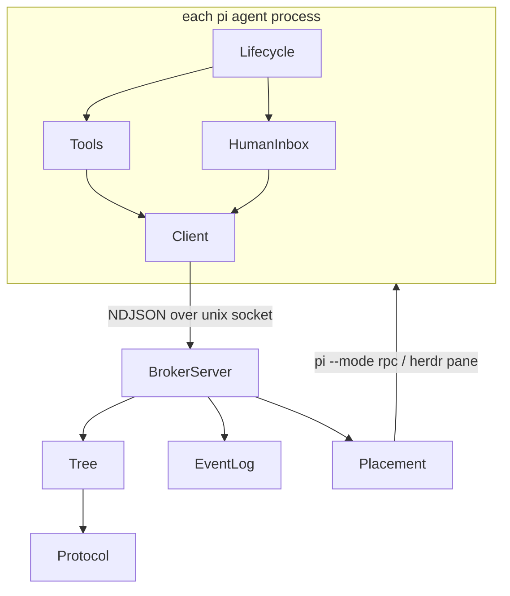
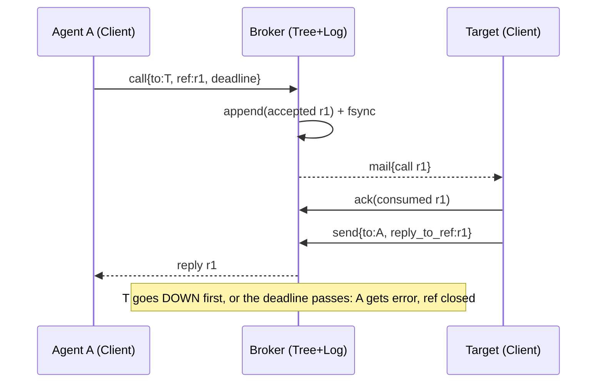

# pi-actors — Design

**Spec:** `specs/pi-actors.md` · **Frame:** no standing frame in this new repo. It uses the default 3-layer split (domain / presentation / shell) plus the conventions of the sibling package `~/work/pi-verified-goal` (TypeScript under `src/`, `node --test` with type stripping, `typebox` and pi as `*` peers, tests drive the extension through a fake pi host). · **Scope note:** this introduces a local helper process and channel. It stays a feature design because it is one package on one machine, with no shared or cloud infrastructure (NFR-2).

## Context and goals

pi agents need to spawn fresh or forked children on any model and exchange messages reliably (UC-1..9). The incumbent's bug history (stale state, lost and duplicated messages, orphans, reload breakage) comes from many ad-hoc file protocols and from detecting liveness by PID. This design copies the Erlang/OTP split:

- isolated processes with one mailbox each;
- one broker per agent tree, owning the registry, mailboxes, links and limits behind one Unix socket;
- liveness taken from the socket connection;
- one pure state machine whose transitions are written to an append-only log, so the broker can be rebuilt by replaying it.

Where an agent runs (headless or a terminal pane) and how its context starts (fresh or fork) are adapters orthogonal to messaging (INV-9).

## Non-goals

- **Workflow engine, fan-out or chain helpers.** Agents compose these from the primitives; built-in workflows are where the incumbent grew to 106k lines.
- **Live mid-turn injection of message content.** Mail is pulled with `receive`. Only an "urgent mail" notice may steer, which keeps one consumption path (INV-3).
- **Retries or model fallback.** Children "let it crash", and the parent decides from the exit reason.
- **Cross-machine transport** (NFR-2). Revisit with NATS JetStream if ever needed.
- **Non-pi agents.** A child must load this extension to have a mailbox.

## Components

| Component    | Responsibility                                                                                             | Layer        | Depends on                | Interface                                                                   | Files                                                 |
| ------------ | ---------------------------------------------------------------------------------------------------------- | ------------ | ------------------------- | --------------------------------------------------------------------------- | ----------------------------------------------------- |
| Protocol     | Frame schemas, size limits, validation, NDJSON encode/decode                                               | Domain       | typebox                   | `Frame` union, `encode(f)`, `decode(line): Frame`, `LIMITS`                 | `src/protocol.ts`                                     |
| Tree         | Pure actor-tree state machine: registry, mailboxes, links, pending calls, limits, exit reasons             | Domain       | Protocol                  | `apply(state, event): {state, effects[]}`, `initial()`                      | `src/tree.ts`                                         |
| EventLog     | Durable append-only log of Tree events, with fsync, replay and compaction                                  | Shell        | Protocol                  | `append(ev)`, `replay(): Event[]`, `compact(state)`                         | `src/broker/log.ts`                                   |
| BrokerServer | Unix-socket server: binds connections to agent IDs, heartbeats, runs `apply` and then performs its effects | Shell        | Tree, EventLog, Placement | `startBroker(dir)`; one process per tree                                    | `src/broker/server.ts`, `src/broker/main.ts`          |
| Placement    | Starts and stops agent processes; one adapter per runtime                                                  | Shell        | —                         | `start(spec): Handle`, `Handle.kill(force)`, `Handle.exited: Promise<code>` | `src/placement/headless.ts`, `src/placement/herdr.ts` |
| Client       | Agent-side connection: hello and identity, reconnect with grace, record of consumed IDs, acks              | Shell        | Protocol                  | `connect(identity)`, `request(frame)`, `onMail(cb)`                         | `src/client/connection.ts`                            |
| Tools        | The 6 model-facing tools; arguments validated, results shaped                                              | Presentation | Client                    | `spawn`, `send`, `call`, `receive`, `kill`, `exit`                          | `src/client/tools.ts`                                 |
| HumanInbox   | The `human` address: `/inbox` and `/answer`, herdr blocked signal                                          | Presentation | Client                    | commands `/inbox`, `/answer <ref> <text>`                                   | `src/client/human.ts`                                 |
| Lifecycle    | Extension wiring: resolve identity (env or root), start broker on demand, wake on mail, done-nudge, reload | Shell        | Client, Tools, HumanInbox | default export `(pi) => void`                                               | `src/index.ts`                                        |

### Tool contracts (model-facing)

| Tool      | Params                                                                                                                 | Result                                                                                                        |
| --------- | ---------------------------------------------------------------------------------------------------------------------- | ------------------------------------------------------------------------------------------------------------- |
| `spawn`   | `task, name?, model?, thinking?, context: "fresh"\|"fork", cwd?, placement?: "headless"\|"pane", limits?, resume?: id` | `{id}` (fails fast when a limit is exceeded)                                                                  |
| `send`    | `to, body, tag?, reply_to_ref?, urgent?`                                                                               | `{msg_id}` once the broker has durably accepted it                                                            |
| `call`    | `to, body, tag?, timeout_s`                                                                                            | the reply body, or an error: `timeout`, `target_down:<reason>`                                                |
| `receive` | `from?, tag?, timeout_s`                                                                                               | the next matching message (mail, a call request with its `ref`, or `DOWN {id, reason, result}`), or `timeout` |
| `kill`    | `id, reason?`                                                                                                          | `{reason: "killed"}` once the DOWN has been recorded                                                          |
| `exit`    | `result` (≤ 64 KiB, or a file path)                                                                                    | ends this agent; the parent receives `DOWN normal` with the result                                            |

A reply is a `send` with `reply_to_ref`. Waiting for children is `receive` filtered on DOWN. Siblings address each other by ID.

## Spec traceability

| Spec element             | Owning component                                              | Notes (what breaks if removed)                                                                                    |
| ------------------------ | ------------------------------------------------------------- | ----------------------------------------------------------------------------------------------------------------- |
| UC-1 fresh spawn         | Tree (admission) + Placement (start)                          | Tree owns the decision; without it, limits are bypassed                                                           |
| UC-2 fork spawn          | Placement                                                     | It runs `pi --fork <parent session file> --model …` in the target `cwd`. Without it there is no inherited context |
| UC-3 send/call           | Tree                                                          | Without it there is no routing or call correlation                                                                |
| UC-4 receive + wake      | Client                                                        | Without it, mail is never consumed, and an idle agent never sees a DOWN                                           |
| UC-5 exit → DOWN         | Tree                                                          | Without it, the parent cannot learn results or failures                                                           |
| UC-6 human escalation    | HumanInbox                                                    | Without it, escalations are only visible to the parent agent                                                      |
| UC-7 kill                | Tree (decision) + Placement (forced)                          | Without it, runaway children can only be killed by hand                                                           |
| UC-8 resume              | Placement (`pi --session <child file>`)                       | Identity churn returns: new ID, lost history                                                                      |
| UC-9 inspect             | Lifecycle (`/actors`)                                         | Without it, the tree is opaque; debugging means reading the log by hand                                           |
| INV-1 no orphans         | Tree (link rule on `parent_lost`)                             | Children of a dead parent run indefinitely                                                                        |
| INV-2 exactly one DOWN   | Tree (terminal state, emitted once)                           | Results are duplicated or lost                                                                                    |
| INV-3 effectively-once   | Client (consumed IDs) + EventLog (accepted before ack)        | A reload re-delivers already-consumed mail, or a crash loses it                                                   |
| INV-4 FIFO per pair      | Tree (per-pair sequence numbers)                              | Messages from one sender are processed out of order                                                               |
| INV-5 monotone limits    | Tree                                                          | Unbounded recursion and fan-out                                                                                   |
| INV-6 fail fast          | Tree                                                          | A caller blocks until its deadline on a dead target                                                               |
| INV-7 reload-safe        | Client (reconnect within grace) + Tree (`disconnected` state) | A reload kills the subtree                                                                                        |
| INV-8 bounded            | Protocol                                                      | The context window floods; the log grows without bound                                                            |
| INV-9 placement-agnostic | Placement (process lifecycle only)                            | Two semantics drift apart (the incumbent's foreground/background split)                                           |

## Data flow

**Spawn (UC-1/2)**

1. The parent's `spawn` sends a `spawn` frame to the Broker.
1. Tree admits it: depth + 1 ≤ the parent's limit, budget not exhausted, live children < cap. It records `child{id, parent, limits∩requested}` and emits a `start` effect.
1. The Broker calls `Placement.start({id, socket, task, model, thinking, cwd, context, parent_session})`.
1. The child's pi loads the extension. Lifecycle reads `PI_ACTORS_SOCKET` and `PI_ACTORS_ID` and sends `hello`. Tree marks the child `live` and delivers the task as its first mail.
1. The Broker replies `{id}` to the parent. A child that doesn't send `hello` within 120 s is recorded `DOWN error:start_timeout`.

**Call (UC-3) and human escalation (UC-6)**

When the target is `human`, the Broker routes the call to the root agent's HumanInbox, which surfaces it in `/inbox`. If the asking agent runs in a herdr pane, its own HumanInbox also emits `herdr:blocked`, so you can answer right there with `/answer r1 …`. Whichever answer reaches the Broker first resolves the ref; any later answer is rejected as stale.

**Wake on mail (UC-4):** the Broker pushes a `mail_available` notice. If the agent is idle, Client calls `pi.sendMessage(notice, {triggerTurn: true})`. If it is busy, the notice is queued as a follow-up, or as a steer when the mail is marked `urgent`. Message content reaches the model only through `receive`.

**Reload (INV-7):** `session_shutdown(reload)` makes Client send `bye{reload}`, and Tree marks the agent `disconnected` with a deadline G. On `session_start(reload)` the new runtime reconnects with the same ID and Tree marks it `live` again. If G passes first, Tree records `DOWN lost`, and the link rule terminates that agent's children.

## State ownership

| State                                                   | Owner        | Mutated by                     | Source of truth                                                                            |
| ------------------------------------------------------- | ------------ | ------------------------------ | ------------------------------------------------------------------------------------------ |
| Registry (ID, parent, status, limits, placement handle) | Tree         | `apply` only                   | EventLog (replayed)                                                                        |
| Mailboxes and per-pair sequence numbers                 | Tree         | `apply` only                   | EventLog                                                                                   |
| Pending calls (ref, caller, deadline)                   | Tree         | `apply` only                   | EventLog                                                                                   |
| Spawn budget counters                                   | Tree         | `apply` only                   | EventLog                                                                                   |
| Consumed message IDs per agent                          | Client       | Client after `receive` returns | The agent's own session (`receive` tool result details), so they survive reload and resume |
| Socket ↔ agent binding                                  | BrokerServer | BrokerServer                   | In memory only; rebuilt by `hello`                                                         |
| OS process or pane                                      | Placement    | Placement                      | The OS / herdr                                                                             |

## Decisions

### D1: One broker per tree, rather than a socket server in each agent

- **Decision:** a separate helper process owns all routing state. It is started by the root agent the first time it spawns, launched as `node src/broker/main.ts` via `process.execPath` (Node type-stripping, NFR-1), and stops when the tree is empty.
- **Driver:** INV-7 (reload-safe), INV-3, INV-1.
- **Alternatives:** a socket server in each agent's extension. Rejected: a reload destroys the server, so mailboxes and links die with the extension instance. This is exactly the incumbent's 22 reload bugs.
- **Reversibility:** costly.
- **Validated by:** `test/reload.test.ts`: reload the parent mid-call; the reply still arrives, children survive, and no DOWN is emitted.

### D2: One pure Tree reducer, persisted as an event log

- **Decision:** every change is an event, appended and fsynced before it is acknowledged. A restarted broker replays the log, and compaction writes a snapshot.
- **Driver:** INV-2, INV-3, NFR-3.
- **Alternatives:** a mutable store such as one JSON file per mailbox. Rejected: multi-file updates aren't atomic, which is the incumbent's stale-state class. SQLite (`node:sqlite`) was considered and rejected: still experimental across the Node versions pi supports, and the broker is the only writer, so an append-only log is enough.
- **Reversibility:** cheap. The storage sits behind EventLog.
- **Validated by:** a property test (`test/tree.property.test.ts`): for random event sequences, replaying the log equals the live state, and each child produces exactly one DOWN.

### D3: Pull consumption (`receive`); a push only wakes the agent

- **Decision:** content enters the model only as a `receive` result. Pushes are short "you have mail" notices.
- **Driver:** INV-3 (one consumption path).
- **Alternatives:** inject message content with `sendMessage`, as the incumbent does. Rejected: there is no ID in the transcript, so "delivered" has to be guessed by matching text (the incumbent's 24 receipt bugs).
- **Reversibility:** cheap.
- **Validated by:** `test/delivery.test.ts`: kill a client between `receive` and the ack; after reconnecting, the message is redelivered and then deduplicated, so it is consumed once.

### D4: Liveness from the socket, plus a heartbeat (15 s interval, 45 s timeout)

- **Driver:** INV-1, INV-6.
- **Alternatives:** PID polling. Rejected: PID reuse and zombies, the incumbent's ~40 liveness fixes.
- **Reversibility:** cheap.
- **Validated by:** `test/links.test.ts`: SIGKILL the parent; its children get `parent_lost` and are gone within G, and the grandparent gets `DOWN lost`.

### D5: Headless placement uses `pi --mode rpc`, owned by the broker in its own process group

- **Decision:** the broker is the OS parent of headless children, so a parent pi reload never kills them. A forced kill is SIGTERM, then SIGKILL to the process group after 5 s.
- **Driver:** INV-7, UC-7.
- **Alternatives:** `pi -p`. Rejected: the process exits after one task and can't receive follow-up mail. In-process SDK sessions were also rejected: they couple to pi internals (incumbent F5) and die with the parent's process.
- **Reversibility:** cheap.
- **Validated by:** a live acceptance test in `test/live/`, run on demand: spawn headless, reload the parent, and the child finishes and reports.

### D6: The human is an addressable process

- **Driver:** UC-6, NFR-4.
- **Alternatives:** an `ask_user` tool that only works in the root agent. Rejected: a pane-hosted child couldn't be answered where its context is.
- **Reversibility:** cheap.
- **Validated by:** `test/human.test.ts`: a call to `human` is answered from the root inbox, and an answer from the pane resolves the same ref, exactly once.

### D7: Done-nudge for children that settle without calling `exit`

- **Decision:** if a child's run settles with no `exit` and no pending `receive`, Lifecycle injects one nudge. If it settles again, the child exits with `error:no_exit`, carrying its last assistant text as the result. Turns started by user input in a pane are exempt.
- **Driver:** INV-2.
- **Alternatives:** treating every settle as exit. Rejected: it would end children that are mid-dialogue with a human in a pane.
- **Reversibility:** cheap.
- **Validated by:** `test/extension.test.ts` with the fake host.

## Failure modes and cross-cutting concerns

| Scenario                                                           | Behaviour                                                                                                                                                                                                                                               | Owner               |
| ------------------------------------------------------------------ | ------------------------------------------------------------------------------------------------------------------------------------------------------------------------------------------------------------------------------------------------------- | ------------------- |
| The broker crashes                                                 | Clients see EOF and retry within G. The root's Lifecycle restarts the broker, which replays the log; agents re-send `hello`. Headless children (own process group) survive. If the broker is still absent after G, every agent exits by itself (INV-1). | Lifecycle, EventLog |
| Partial log write (crash mid-append)                               | Replay drops a trailing incomplete line; that frame was never acknowledged, so the sender retries it.                                                                                                                                                   | EventLog            |
| Same message delivered twice after a reconnect                     | Client checks the consumed-ID record and acknowledges without surfacing it again.                                                                                                                                                                       | Client              |
| A call is answered after its deadline                              | The ref is already closed, so the late reply is rejected with `stale_ref` and recorded.                                                                                                                                                                 | Tree                |
| Two parents race to spawn against the last budget slot             | Admission is serialized in `apply`; one wins and the other fails fast.                                                                                                                                                                                  | Tree                |
| A child pi fails to start (bad model, missing auth)                | No `hello` within 120 s → `DOWN error:start_timeout`, with the child's stderr tail as the result.                                                                                                                                                       | Placement, Tree     |
| A fork of a parent whose session isn't saved yet                   | `spawn` fails fast with `no_session_file`; it never silently becomes a fresh child.                                                                                                                                                                     | Placement           |
| A forked child edits the parent's checkout instead of its worktree | The fork's first mail states its `cwd` and says to edit only there; pi's fork rewrites the session's cwd.                                                                                                                                               | Placement           |
| Oversized message or result                                        | Rejected above 64 KiB with an instruction to write a file and send its path; the cut is marked, never silent.                                                                                                                                           | Protocol            |
| herdr missing or not running                                       | Placement `pane` fails fast with `herdr_unavailable`; headless still works.                                                                                                                                                                             | Placement           |
| Observability                                                      | `/actors` shows the tree, status and mailbox depth; the EventLog doubles as a trace. Message bodies are not logged by default, only IDs and sizes, to keep the log small.                                                                               | Lifecycle, EventLog |
| Security                                                           | The socket and log live under a per-user `0700` runtime directory. Only processes running as that user can connect, and every frame is validated.                                                                                                       | BrokerServer        |

## Conformance rules (machine-checkable)

Enforced by `test/conformance.test.ts`, which scans import statements:

- `src/protocol.ts` and `src/tree.ts` import only `typebox` and each other: no `node:*`, no `@earendil-works/*`.
- `src/broker/**` and `src/placement/**` never import `@earendil-works/*` (the broker runs outside pi).
- `src/client/**` imports `src/protocol.ts` but nothing from `src/broker/**`, `src/placement/**` or `src/tree.ts`.
- Only `src/broker/server.ts` imports `src/placement/**`.
- `package.json` has no `dependencies`; host packages appear only in `peerDependencies` with `"*"`.

[DECISION NEEDED: G (link grace) defaults to 60 s, long enough to ride out a pi reload. Confirm, or name a value.] [DECISION NEEDED: default limits: max depth 2 (coordinator = 0 → item = 1 → frontend/backend/reviewer = 2), 6 live children per agent, 40 spawns per tree. Confirm.]
